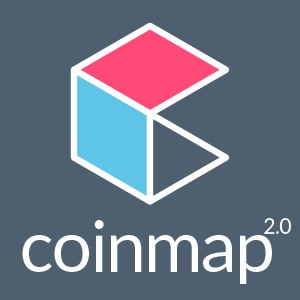
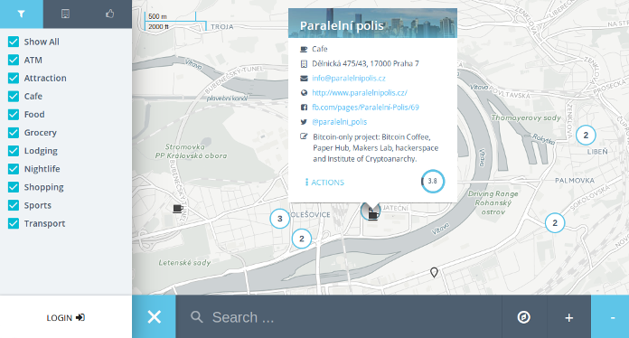
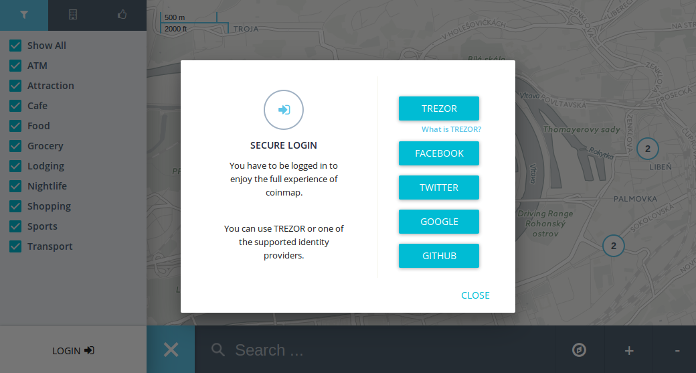
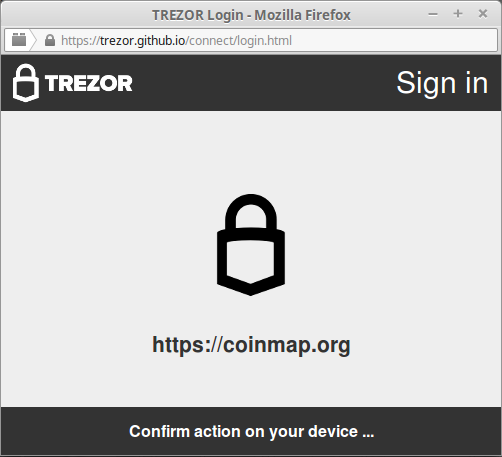

Coinmap
=======

What is Coinmap?
----------------

`Coinmap <https://coinmap.org>`_ is a map where you go to learn about bitcoin shops and businesses.
It is also great tool for journalists who want to study and report on an adoption of bitcoin in real economy.
Recently, brand new redesigned **Coinmap 2.0** has been released which allows for a fast creation of map venues 
and also user ratings and reporting. 

Find out about bitcoin shops in your neighbourhood and on your travels! Let your customers know you accept bitcoin!

Resources
---------

- `Website <https://coinmap.org>`_

TREZOR User Manual
------------------

You can use your TREZOR to sign into Coinmap securely and privately, **no email, name or other user info is required**.
Just click on Login button at the bottom left and select TREZOR.

You will be asked to confirm the action on your TREZOR.

If your device is locked, you will have to enter your PIN. Note, that PIN is never asked again until you disconect and reconnect the device.

.. image:: images/coinmap05.png

When signed in, adding a new venue is a matter of seconds: Right click on the location where you want to plase new venue 
and select Add Venue. Then fill out name of your business and other details and click Save. That's it,
you have just added your business to Coinmap.

.. image:: images/coinmap01.png

Go ahead and check it out at `coinmap.org <https://coinmap.org>`_!
