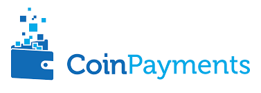
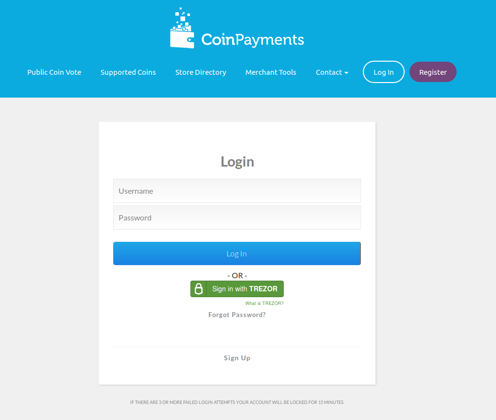
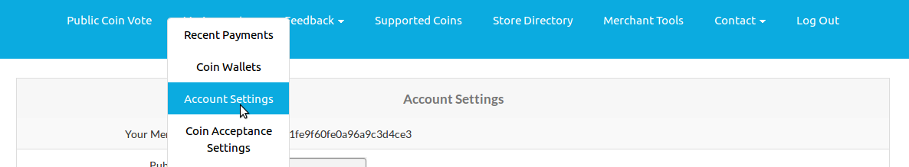
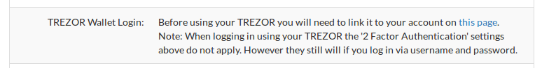
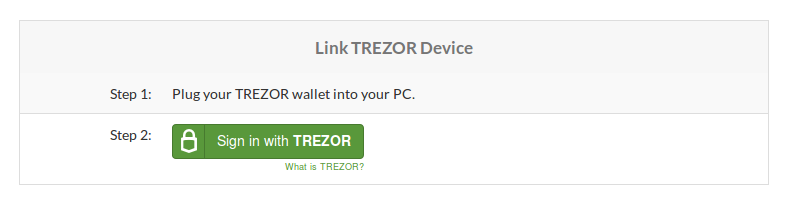
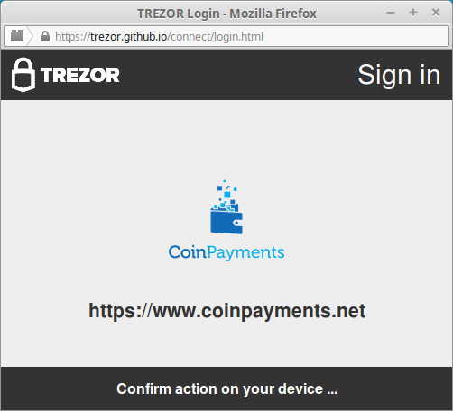
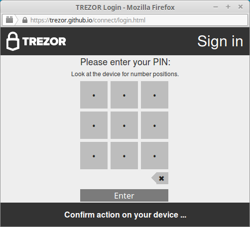
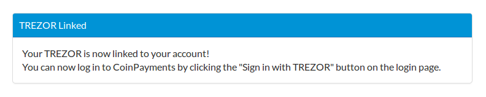
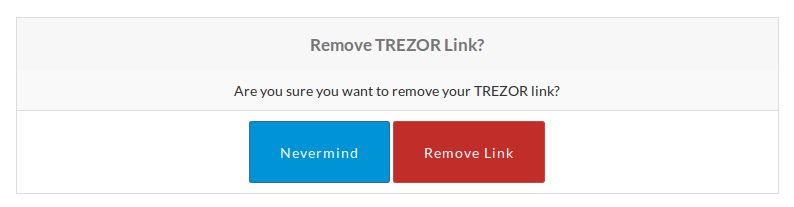
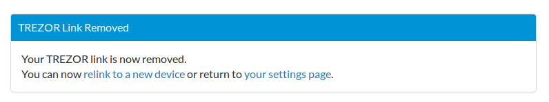

Coinpayments
===================

What is Coinpayments?
-------------------------

`Coinpayments <https://coinpayments.net>`_ is an online payment processor service allowing you to buy and sell
items easily with `any crypto currency <https://www.coinpayments.net/supported-coins>`_. 
Merchants can now safely manage their accounts thanks to `Sign in with TREZOR <../trezor-tech/api-connect.html>`_ 
feature allowing for passwordless and secure authentication.

Resources
---------

- `Website <https://coinpayments.net>`_
- `Support <https://coinpay.freshdesk.com/support/home>`_

TREZOR User Manual
------------------

Before you can Sign in with your TREZOR, you have to **sign up with username & password** first. 
After account email verification, go ahead and sign in with your credentials. 

**To pair the TREZOR device with your account**, select My Account and Account Settings,

and in TREZOR Wallet Login section, follow "this page" link.

Now, when you connect your TREZOR and click on Sign in with TREZOR,

You will be asked to confirm the action on your TREZOR,

and authenticate with your PIN. Note, that PIN is never asked again until you disconect and reconnect the device.

Finally, enter your account password and complete the procedure.

.. image:: images/coinpayments06.png

From now, you will be able to Sign in with TREZOR and never again worry that your password might be stolen by a keylogger. 
Go ahead and try it!

In case you ever need to **unlink your TREZOR**, you can do it easily in TREZOR Wallet Login section of Account Settings. 
After clicking on Remove link,

you will get confirmation that your TREZOR link was removed. Of course, you can easily relink the device again whenever you want.

