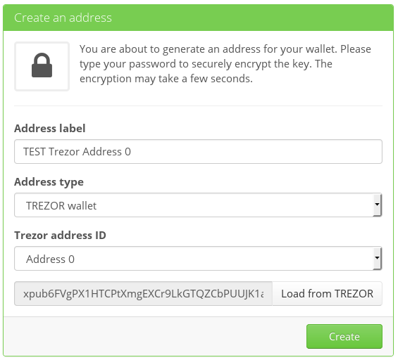
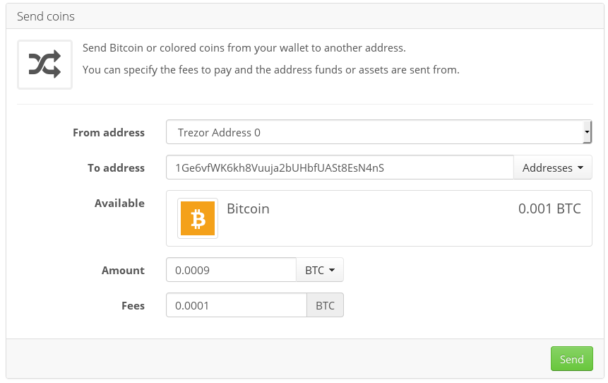
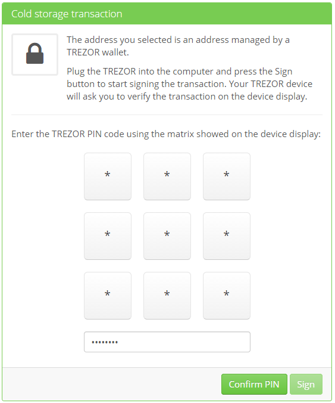
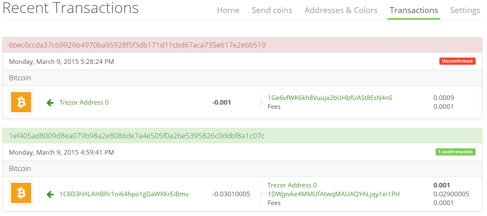

Coinprism
=========

What is Coinprism?
------------------

`Coinprism <https://www.coinprism.com/>`_ is a web colored coin wallet. Use the Bitcoin blockchain with any kind of asset beside Bitcoin like Stocks, Currencies, Smart properties etc.
For more information on Colored coins (Open Assets) click `here <https://coinprism.desk.com/customer/portal/articles/1451842-what-are-colored-coins->`_.

=================================================== =================== ====================================================================================================================================
Wallet Property                                                         Description
----------------------------------------------------------------------- ------------------------------------------------------------------------------------------------------------------------------------
:icon:`laptop` Platform                 			✔                   Web, Android
:icon:`money` Coin(s)                   			✔                   Bitcoin, Colored coins (Open Assets)
:icon:`language` Languages                          ✔                   English                   
:icon:`book` Address Book                           ✔                   Manage contact list of receiving and sending addresses
:icon:`comment` Labelling                			✔					Add comments and labels to accounts and transactions
=================================================== =================== ====================================================================================================================================

=================================================== =================== ===========================================================================================================
Trezor Feature                                                          Description
----------------------------------------------------------------------- -----------------------------------------------------------------------------------------------------------
:icon:`cog` Basic Setup                 			                    Generate new wallet with recovery seed, set PIN and label device
:icon:`life-ring` Safe Recovery         			                    Recover TREZOR by safely entering your recovery seed (12, 18 or 24 words)
:icon:`exchange` Simple transactions    			✔					Sign transaction with TREZOR and confirm address and amount on display
:icon:`users` Multisig transactions                                     Sign multisignature transaction with TREZOR
:icon:`user-secret` Hidden Wallets  			    ✔                   User can access hidden wallets each behind arbitrary passphrase
:icon:`bars` Multiple Accounts           								Capable of creating and working with multiple accounts
:icon:`th`   Smart PIN Matrix           			✔					Keylogger protection, displaying PIN matrix on TREZOR's display
:icon:`eye-slash` Watch-only mode                                       Remembering account, generating new receiving address with TREZOR disconected
:icon:`eye`  Show on TREZOR     			          					Phishing protection, validation receiving address on TREZOR
:icon:`eyedropper` Import single address            ✔                   Importing watch-only addresses one by one
:icon:`sliders` Change PIN              			                    User can change TREZOR's PIN
:icon:`sliders` Change Name          			   	                    User can change TREZOR's name
:icon:`paint-brush` Custom Homescreen            	 					User can upload personalized default screen
:icon:`upload`  Update Firmware         			   					Notify user and update firmware when new version is available
:icon:`fire` Wipe device                 			 					Erase private keys from TREZOR
:icon:`envelope` Sign Message                                           Securely sign short text
:icon:`envelope` Verify Message                                         Securely verify short text
:icon:`magnet` Fast Recovery                                            Recover by directly loading seed into TREZOR, fast but less safe way to recover wallet
:icon:`lock` Wallet Encryption                                          Wallet can be decrypted and opened using TREZOR only
:icon:`lock` Sign in with TREZOR                                        TREZOR is used for online authentication without using username and password
=================================================== =================== ===========================================================================================================

Resources
---------

- `Website <https://www.coinprism.com>`_
- `Support <https://coinprism.desk.com>`_
- `Blog <http://blog.coinprism.com>`_

TREZOR User Manual
------------------

To import address from TREZOR, sign into your Coinprism account and create a new color address. Select TREZOR Wallet as Address Type, connect your TREZOR and click Load from TREZOR. After you public account key is loaded, select Trezor address ID to load and click Create.

When spending from TREZOR address, go to Send coins, select TREZOR address, fill receving address and amount and click Send.

You will be asked to connected your TREZOR, enter your PIN, check transaction details on display before clicking Sign.

After signing, your transaction will be listed as unconfirmed in transaction list.

