CoinSimple
==========

.. image:: images/coinsimple_logo.png

What is CoinSimple?
-------------------------

`CoinSimple <https://coinsimple.com>`_ is an online Bitcoin invoincing service and wallet connector which offers passwordless login with TREZOR.
Get the benefits of a Bitcoin payment processor and a secure & private watch-only wallet in one. 
Connect your CoinSimple account to your TREZOR account of your choice and begin invoicing your customers. 
You can see all open and closed invoices in one glance. See more details `here <https://coinsimple.com/faq/#what-is-coinsimple>`_

Resources
---------

- `Website <https://coinsimple.com>`_
- `Support <https://coinsimple.com/support>`_
- `FAQ <https://coinsimple.com/faq/#what-is-coinsimple>`_
- `Blog <https://coinsimple.com/blog>`_

TREZOR User Manual
------------------

After you sign up and create New Business, select it and go to Settings. In TREZOR wallet section click on Connect to start importing your TREZOR account public key.

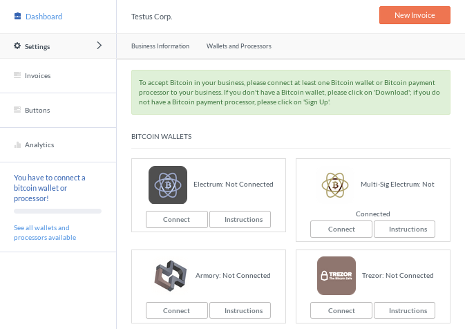

The following dialog will appear.

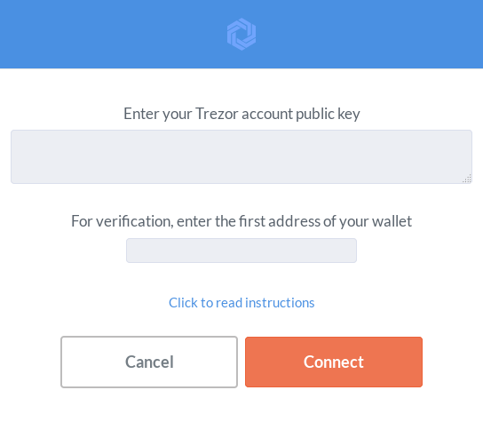

Open new tab in your browsers and go to `myTREZOR.com <https://mytrezor.com>`_. Connect your TREZOR. 
In Basic settings copy selected account public key into the clipboard. And paste it into CoinSimple dialog into the first field.
We recommend you to create brand new account for this purpose (although you can also use one of your non-empty accounts if you want).

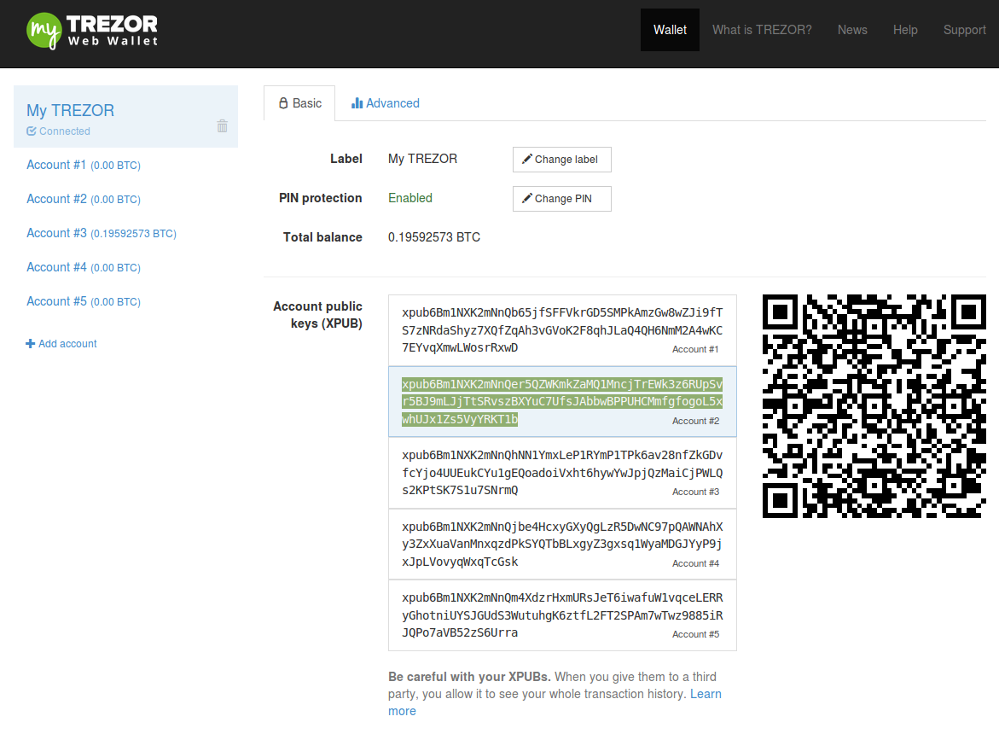

For verification, go back to myTREZOR and copy the first receiving account address and paste into the second field. 

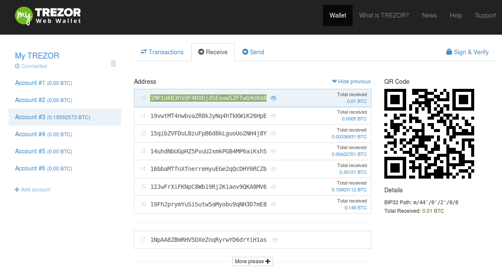

When ready, click on Connect button.

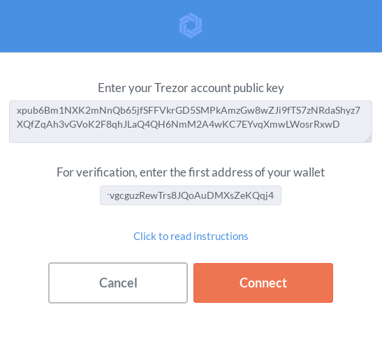

Now, you should see TREZOR as "Connected" and you are ready to create your first invoice.

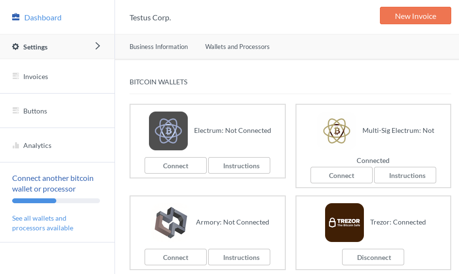

When your customer receives your invoice through email, he will display it online in browsers to see full details.

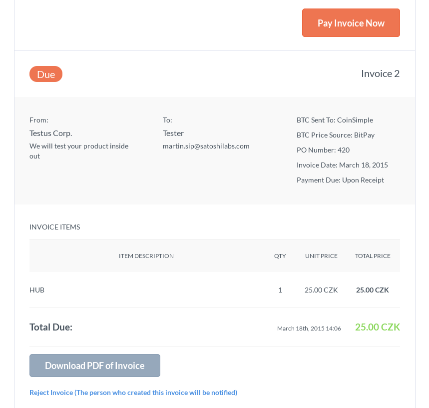

After he clicks Pay Invoice Now, dialog with a new receiving address belonging to your account will be displayed.
The amount shown in bitcoins is computed based on the current rate on exchange you specified during invoice creation.
The customer has 15 minutes to make the payment.

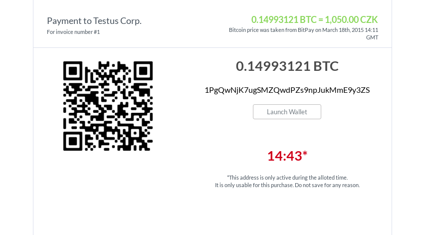

After successfull payment, email confirmation is sent to you and your customer.

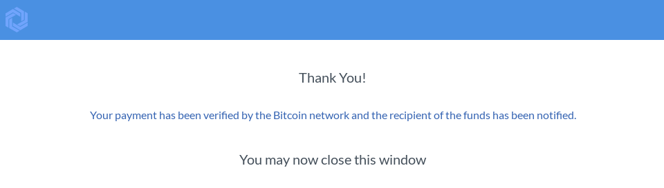

You can also quickly check current status of your payments in the Invoice section.

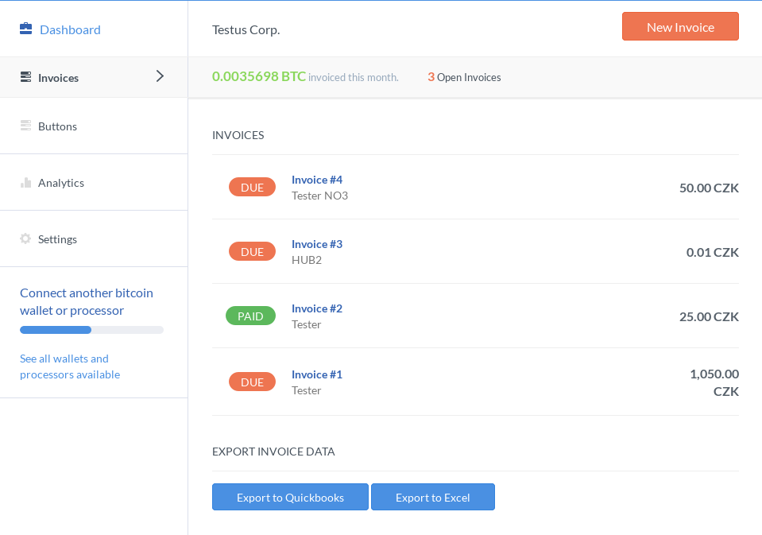

TREZOR Connect Manual
---------------------

Before you can Sign in with TREZOR, you have to link your device to the account. 
Go to User Settings and scroll down to TREZOR Login section.

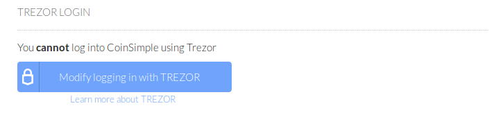

Click on Modify logging in with TREZOR to start linking procedure. You will be asked to confirm the action on your TREZOR.

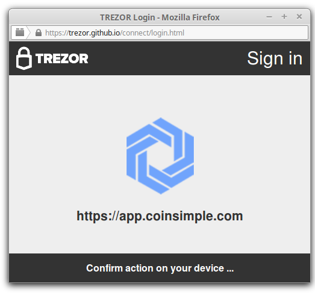

Authenticate with your PIN. Note, that PIN is never asked again until you disconect the device.

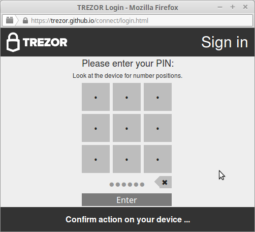

To finish the procedure you will be asked to confirm the action by clicking on the link in your email.

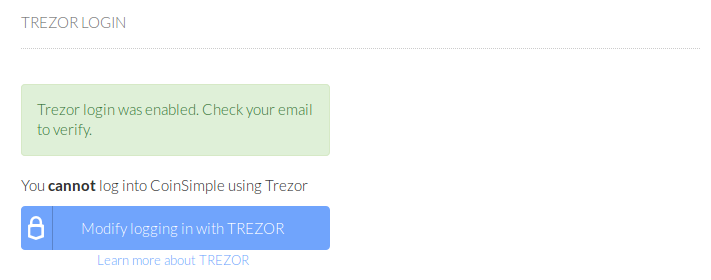

After the confirmation everything is ready for your first passwordless authentication with TREZOR.

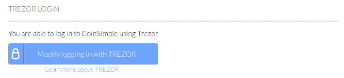

Logout and click on Log in with TREZOR to test it.

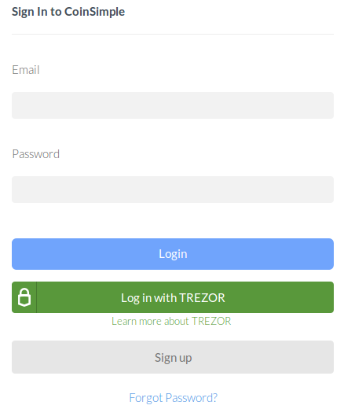
