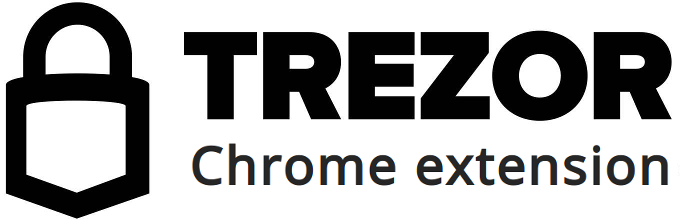
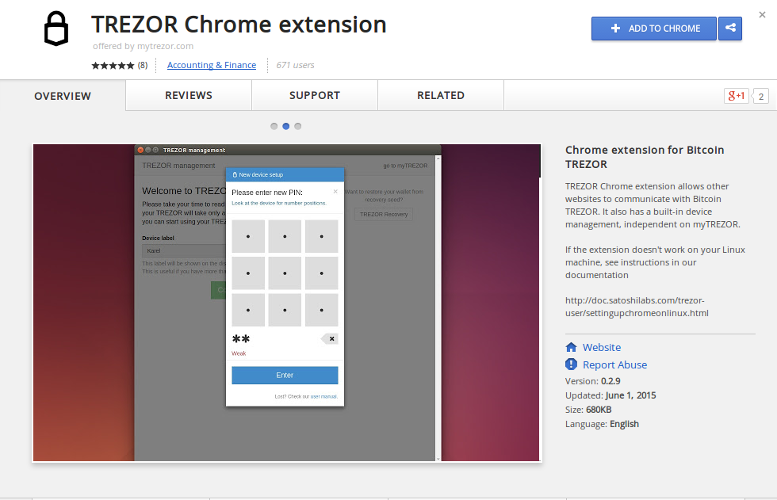
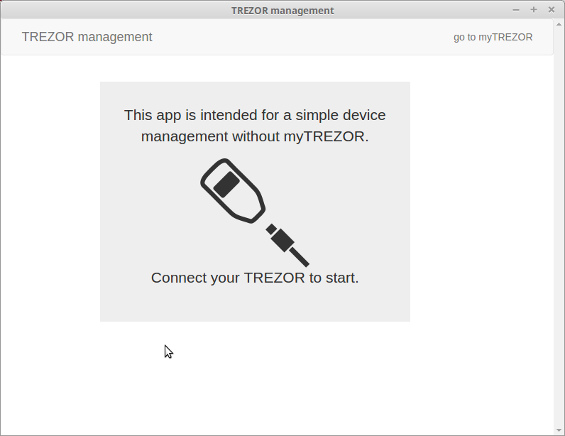
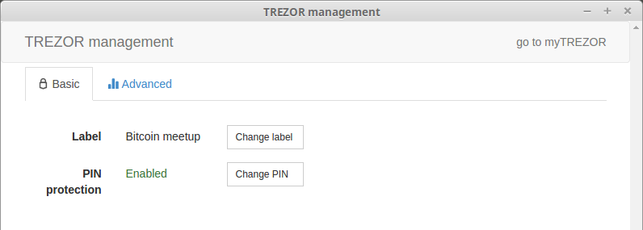
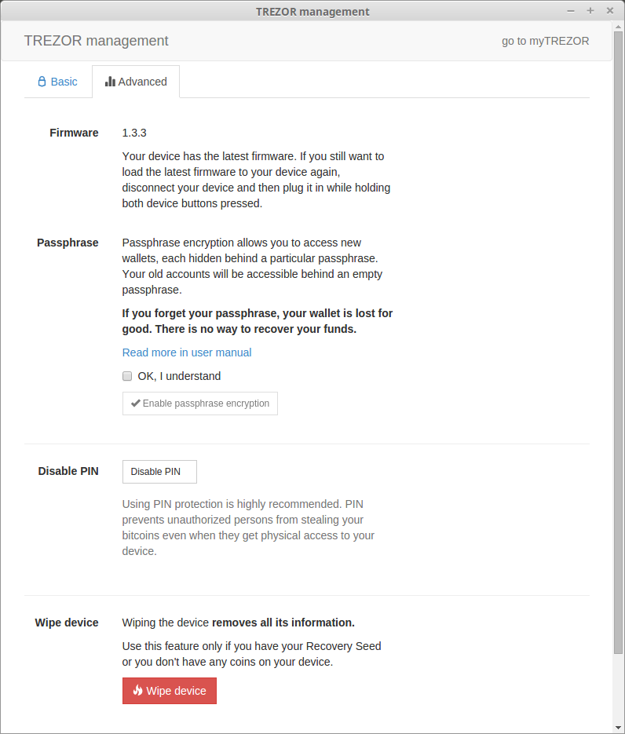

Chrome extension
================

What is TREZOR Chrome extension?
--------------------------------

Thanks to `TREZOR Chrome extension <https://chrome.google.com/webstore/detail/trezor-chrome-extension/jcjjhjgimijdkoamemaghajlhegmoclj>`_ 
you can **access TREZOR management functionality independently of your particular wallet solution**. These features include device initialization, 
wipe, recovery and others like changing PIN and setting up hidden wallet with passphrase. The extension has all the features for configuring 
your device as myTREZOR wallet has while it **runs even on computer offline**.

=================================================== =================== ===========================================================================================================
Software Property                                                       Description
----------------------------------------------------------------------- -----------------------------------------------------------------------------------------------------------
:icon:`laptop` Platform                 			✔                   desktop & mobile using Chrome extension
:icon:`language` Languages                          ✔                   English                   
=================================================== =================== ===========================================================================================================

=================================================== =================== ===========================================================================================================
Trezor Management Feature                                               Description
----------------------------------------------------------------------- -----------------------------------------------------------------------------------------------------------
:icon:`cog` Basic Setup                 			✔                   Generate new wallet with recovery seed, set PIN and label device
:icon:`life-ring` Safe Recovery         			✔                   Recover TREZOR by safely entering your recovery seed (12, 18 or 24 words)
:icon:`th`   Smart PIN Matrix           			✔					Keylogger protection, displaying PIN matrix on TREZOR's display
:icon:`sliders` Change PIN              			✔                   User can change TREZOR's PIN
:icon:`sliders` Change Name          			   	✔                   User can change TREZOR's name
:icon:`paint-brush` Custom Homescreen            	 					User can upload personalized default screen
:icon:`user-secret` Manage Passphprase  			✔                   User can turn on/off passphrase used with hidden wallets
:icon:`upload`  Update Firmware         			✔  					Notify user and update firmware when new version is available
:icon:`fire` Wipe device                 			✔					Erase private keys from TREZOR
:icon:`magnet` Fast Recovery                                            Recover by directly loading seed into TREZOR, fast but less safe way to recover wallet
=================================================== =================== ===========================================================================================================

Beside the management features, TREZOR Chrome extension serves as the communication layer between your device and online wallets and services. 
This means that with the extension already on your computer, you don't have to install anything else (neither plugin nor bridge) when you want to use TREZOR online,
supposing you are using Chrome browser.

Resources
---------

- `Download <https://chrome.google.com/webstore/detail/trezor-chrome-extension/jcjjhjgimijdkoamemaghajlhegmoclj>`_
- `User manual <../trezor-user/settingup.html>`_
- `Support (email) <mailto: support@bitcointrezor.com>`_
- `Blog <http://satoshilabs.com/news>`_, `Facebook <https://www.facebook.com/BitcoinTrezor>`_, `Twitter <https://twitter.com/BitcoinTrezor>`_, `Reddit <http://www.reddit.com/r/TREZOR/>`_

TREZOR User Manual
------------------

Before you can start managing your TREZOR device, you have to install the extension. Start your Chrome browser, go to 
`Chrome Web Store <https://chrome.google.com/webstore/detail/trezor-chrome-extension/jcjjhjgimijdkoamemaghajlhegmoclj>`_,
click on Add to Chrome and confirm the action.

When window with TREZOR Chrome extension icon appears, right click on it and select Create Shortcuts to be able to quickly launch 
the extension from desktop or application menu. If you don't create shortcut now, you can access the extension later by 
opening new browser tab and clicking on Apps button.

.. note:: If you are running Linux, there is one more step to do. Please follow instructions `here <../trezor-user/settingupchromeonlinux.html>`_ 

The TREZOR Chrome extension runs in a separate window and you will be asked to connect your device first:

After you connect and go though TREZOR `initialization <../trezor-user/settingup.html>`_, you will be able to manage your device on two separate tabs.
On Basic tab, you can set the name of your TREZOR and change your PIN.

On Advanced you can check TREZOR's firmware version, turn on/off passphrase to access hidden wallets, disable PIN and wipe your TREZOR.

Find out more about how to manage your device `in myTREZOR documentation <../trezor-user/index.html>`_
