MultiBit HD
===========

What is MultiBit HD?
--------------------

`MultiBit HD <https://multibit.org/>`_ is a lightweight desktop wallet for Windows, Linux and OSX written in Java with over 40 international languages support.

=================================================== =================== ===========================================================================================================
Wallet Property                                                         Description
----------------------------------------------------------------------- -----------------------------------------------------------------------------------------------------------
:icon:`laptop` Platform                 			✔                   Windows, Linux, OSX
:icon:`money` Coin(s)                   			✔                   Bitcoin
:icon:`language` Languages                          ✔                   English and `over 40 other languages <https://crowdin.com/project/multibit-hd>`_
:icon:`book` Address Book                           ✔                   Manage contact list of receiving and sending addresses
:icon:`comment` Labelling                			 					Add comments and labels to accounts and transactions
=================================================== =================== ===========================================================================================================

=================================================== =================== ===========================================================================================================
Trezor Feature                                                          Description
----------------------------------------------------------------------- -----------------------------------------------------------------------------------------------------------
:icon:`cog` Basic Setup                 			✔                   Generate new wallet with recovery seed, set PIN and label device
:icon:`life-ring` Safe Recovery         			                    Recover TREZOR by safely entering your recovery seed (12, 18 or 24 words)
:icon:`exchange` Simple transactions    			✔					Sign transaction with TREZOR and confirm address and amount on display
:icon:`users` Multisig transactions                                     Sign multisignature transaction with TREZOR
:icon:`user-secret` Hidden Wallets  			                        User can access hidden wallets each behind arbitrary passphrase
:icon:`bars` Multiple Accounts           			 					Capable of creating and working with multiple accounts
:icon:`th`   Smart PIN Matrix           			✔					Keylogger protection, displaying PIN matrix on TREZOR's display
:icon:`eye-slash` Watch-only mode                                       Remembering account, generating new receiving address with TREZOR disconected
:icon:`eye`  Show on TREZOR     			          					Phishing protection, validation receiving address on TREZOR
:icon:`sliders` Change PIN              			✔                   User can change TREZOR's PIN
:icon:`sliders` Change Name          			   	                    User can change TREZOR's name
:icon:`paint-brush` Custom Homescreen            	 					User can upload personalized default screen
:icon:`upload`  Update Firmware         			   					Notify user and update firmware when new version is available
:icon:`fire` Wipe device                 			✔					Erase private keys from TREZOR
:icon:`envelope` Sign Message                       ✔                   Securely sign short text
:icon:`envelope` Verify Message                     ✔                   Securely verify short text
:icon:`magnet` Fast Recovery                                            Recover by directly loading seed into TREZOR, fast but less safe way to recover wallet
:icon:`lock` Wallet Encryption                      ✔                   Wallet can be decrypted and opened using TREZOR only
:icon:`lock` Sign in with TREZOR                                        TREZOR is used for online authentication without using username and password
=================================================== =================== ===========================================================================================================

Resources
---------

- `Website <https://multibit.org>`_
- `Download <https://multibit.org/download.html>`_
- `Support <https://multibit.org/en/help/hd0.1/contents.html>`_
- `Blog <https://multibit.org/blog.html>`_

TREZOR User Manual
------------------

When you already have your TREZOR initilized from myTREZOR wallet, connect your TREZOR, 
start MultiBit and choose Create New Trezor wallet to import your first account. 
Note that other accounts cannot be imported and used in MultiBit.

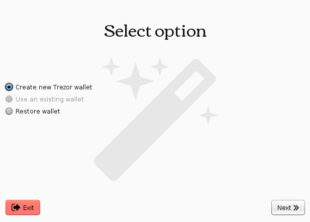

Each time you access your wallet, it must be decrypted by TREZOR, so you need to enter the PIN first to unlock it.

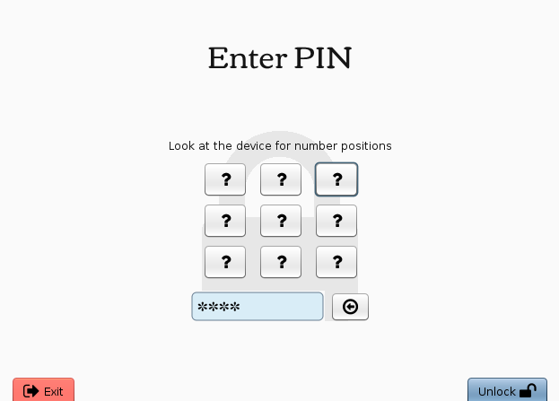

And confirm on TREZOR the action.

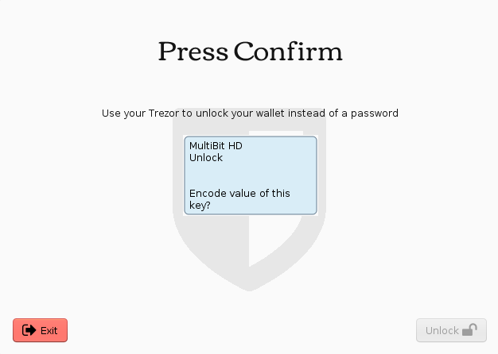

Then MultiBit will load and sync your account. 

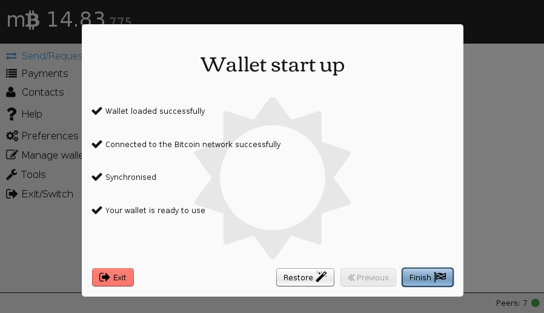

To check your transactions history go to Payments tab.

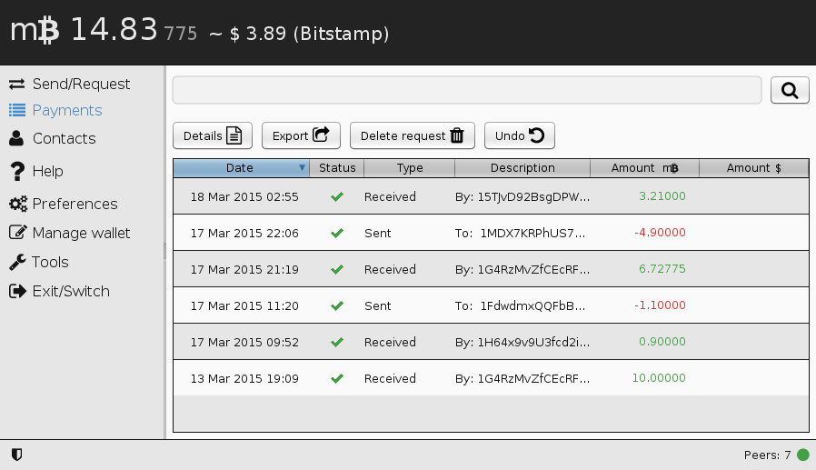

To send transaction click on Send in Send/Request tab.

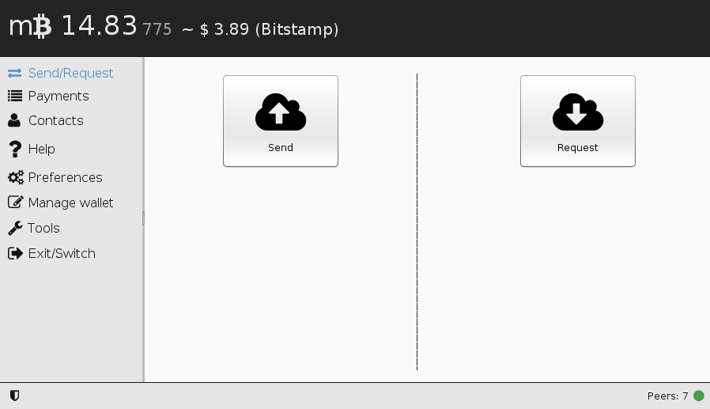

After filling destination address, amount and your private note, click on Send.

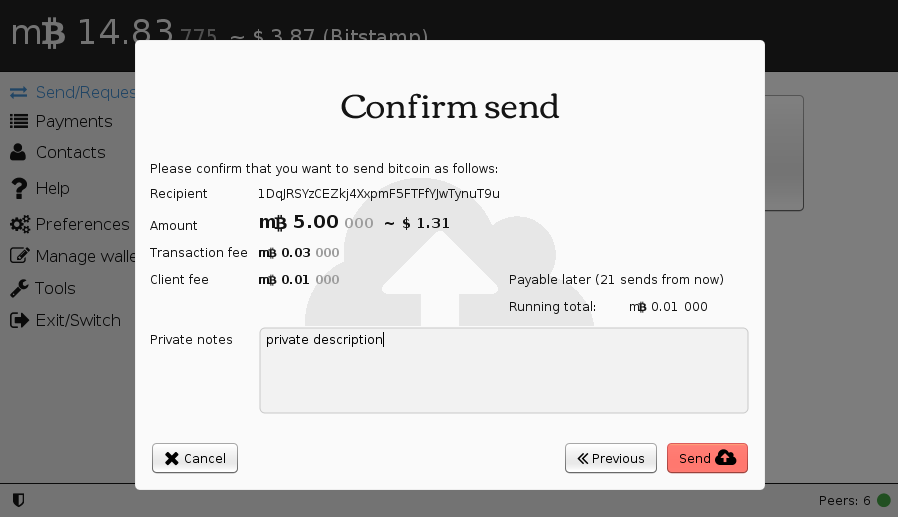

You will be asked to confirm you the transaction on TREZOR in several steps.

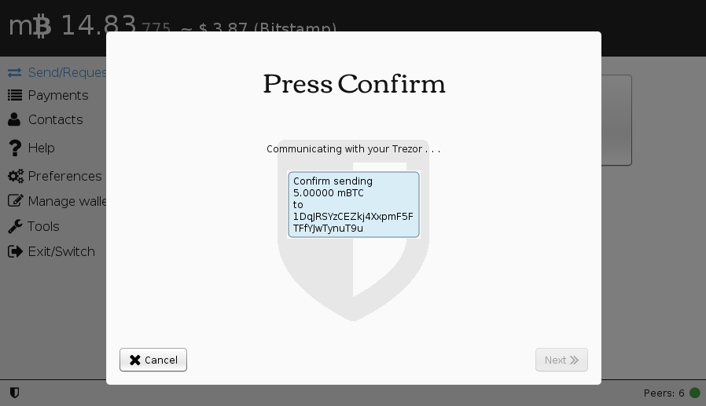

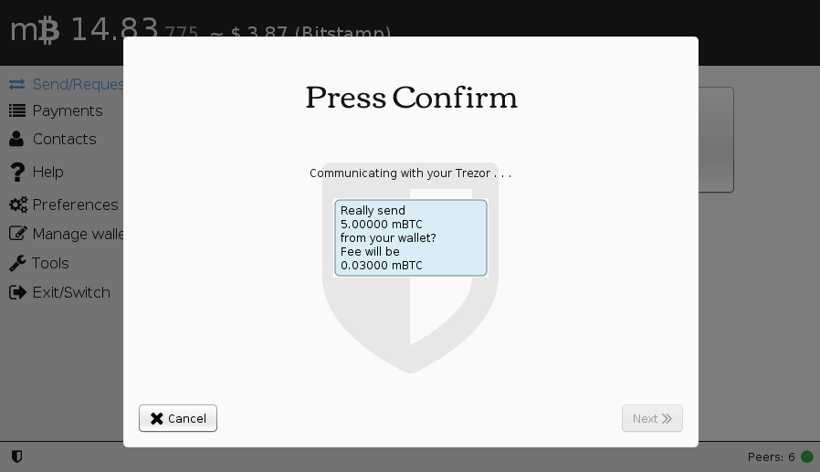

When finished, a new transaction will be shown as "Sending", until it is confirmed by the Bitcoin network.

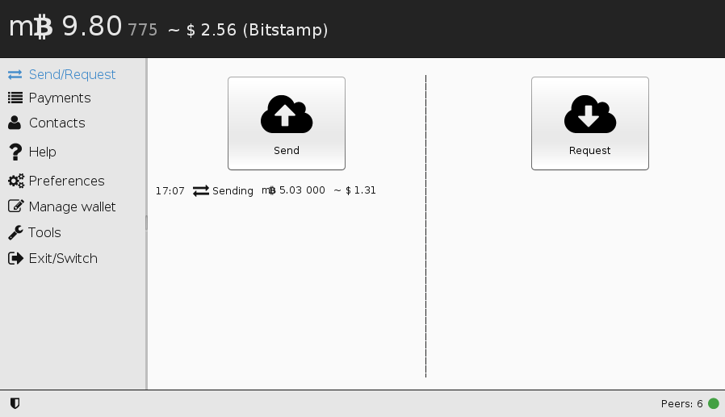

You can manage your TREZOR device in Preferences and Tools tab.

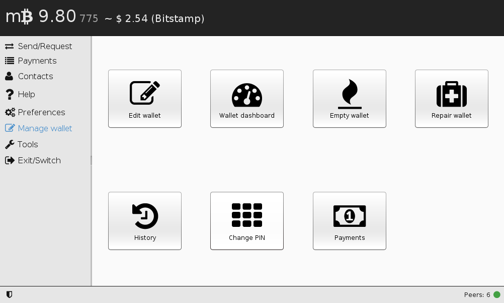

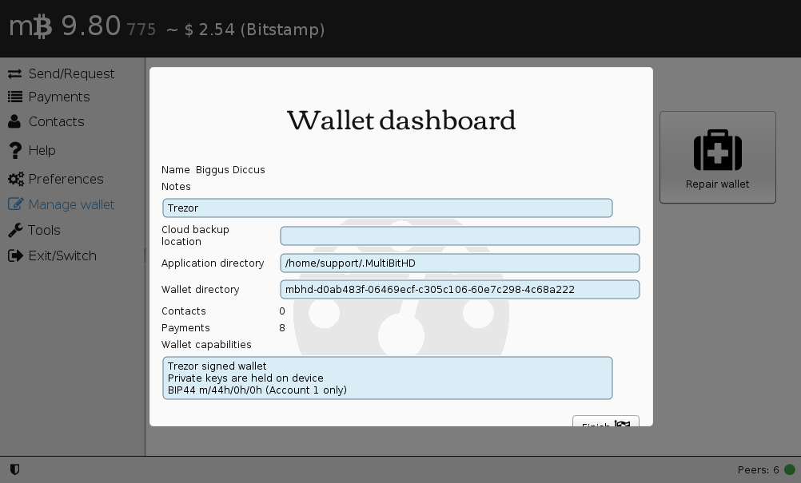

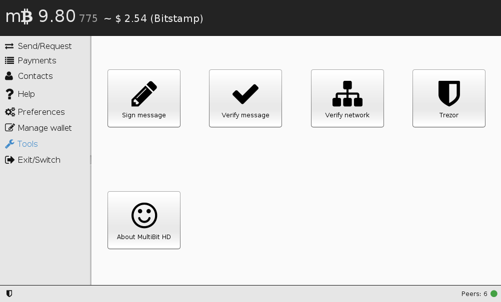

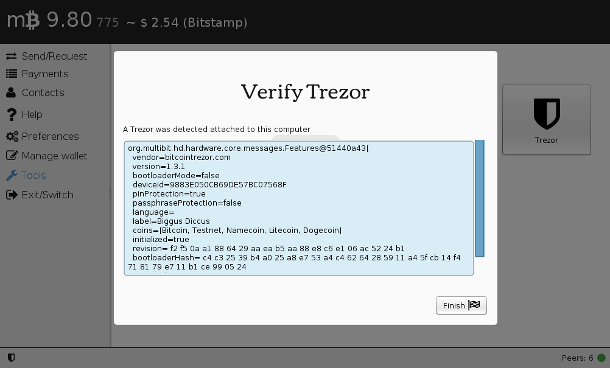
