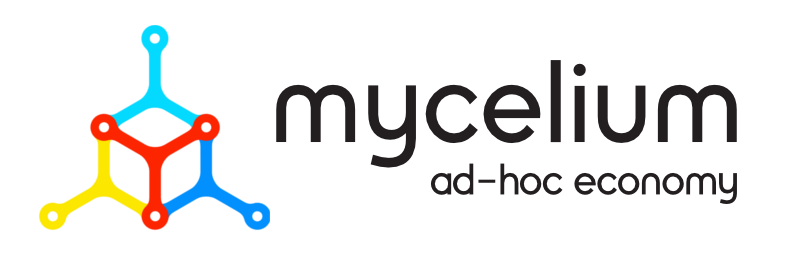
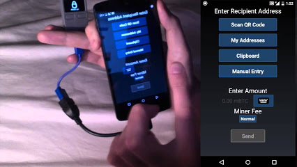
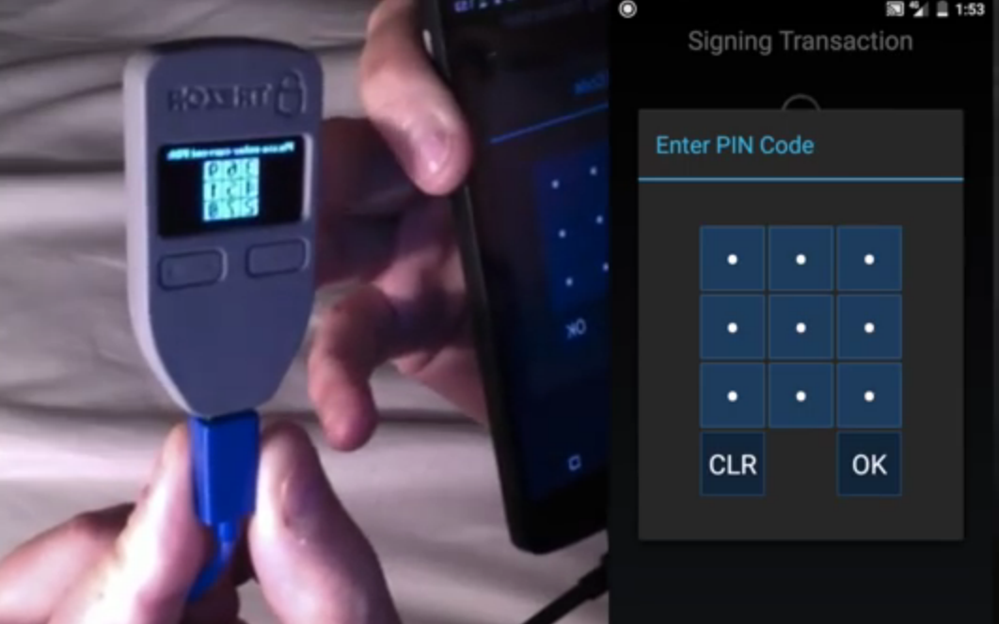

Mycelium
========

What is Mycelium?
-----------------

`Mycelium <https://mycelium.com/>`_ is a mobile Bitcoin wallet for Android and iOS, although TREZOR is curently supported only on Android device.

=================================================== =================== ===========================================================================================================
Wallet Property                                                         Description
----------------------------------------------------------------------- -----------------------------------------------------------------------------------------------------------
:icon:`laptop` Platform                 			✔                   Android
:icon:`money` Coin(s)                   			✔                   Bitcoin
:icon:`language` Languages                          ✔                   English and many others.              
:icon:`book` Address Book                           ✔                   Manage contact list of receiving and sending addresses
:icon:`comment` Labelling                			✔					Add comments and labels to accounts and transactions
=================================================== =================== ===========================================================================================================

=================================================== =================== ===========================================================================================================
Trezor Feature                                                          Description
----------------------------------------------------------------------- -----------------------------------------------------------------------------------------------------------
:icon:`cog` Basic Setup                 			                    Generate new wallet with recovery seed, set PIN and label device
:icon:`life-ring` Safe Recovery         			                    Recover TREZOR by safely entering your recovery seed (12, 18 or 24 words)
:icon:`exchange` Simple transactions    			✔					Sign transaction with TREZOR and confirm address and amount on display
:icon:`users` Multisig transactions                                     Sign multisignature transaction with TREZOR
:icon:`user-secret` Hidden Wallets  			    ✔                   User can access hidden wallets each behind arbitrary passphrase
:icon:`bars` Multiple Accounts           			✔					Capable of creating and working with multiple accounts
:icon:`th`   Smart PIN Matrix           			✔					Keylogger protection, displayign PIN matrix on TREZOR's display
:icon:`eye-slash` Watch-only mode                   ✔                   Remembering account, generating new receiving address with TREZOR disconected
:icon:`eye`  Show on TREZOR     			          					Phishing protection, validation receiving address on TREZOR
:icon:`sliders` Change PIN              			                    User can change TREZOR's PIN
:icon:`sliders` Change Name          			   	                    User can change TREZOR's name
:icon:`paint-brush` Custom Homescreen            	 					User can upload personalized default screen
:icon:`upload`  Update Firmware         			   					Notify user and update firmware when new version is available
:icon:`fire` Wipe device                 			 					Erase private keys from TREZOR
:icon:`envelope` Sign Message                                           Securely sign short text
:icon:`envelope` Verify Message                                         Securely verify short text
:icon:`magnet` Fast Recovery                                            Recover by directly loading seed into TREZOR, fast but less safe way to recover wallet
:icon:`lock` Wallet Encryption                                          Wallet can be decrypted and opened using TREZOR only
:icon:`lock` Sign in with TREZOR                                        TREZOR is used for online authentication without using username and password
=================================================== =================== ===========================================================================================================

Resources
---------

- `Website <https://mycelium.com>`_
- `Download for Android <https://play.google.com/store/apps/details?id=com.mycelium.wallet>`_

TREZOR User Manual
------------------

