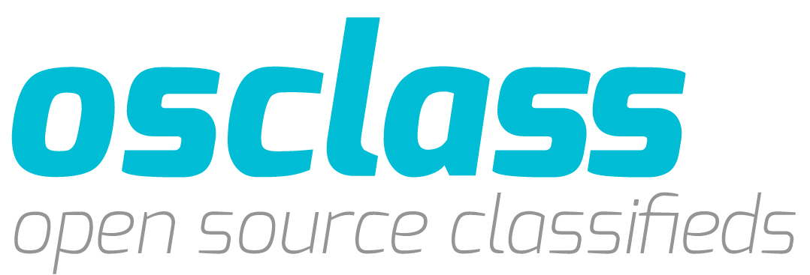
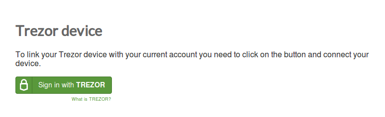
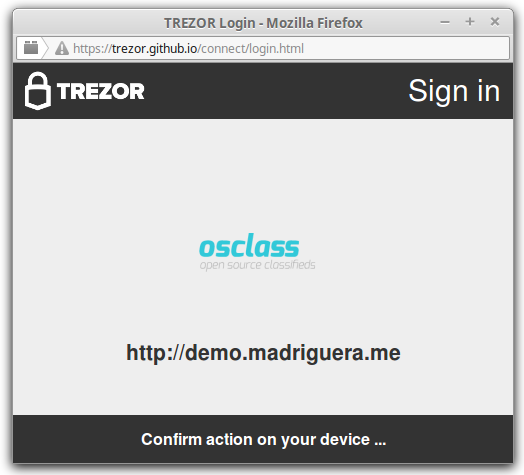
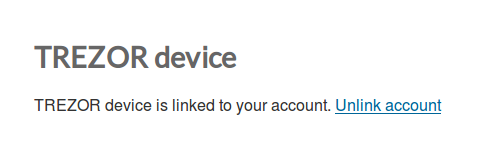
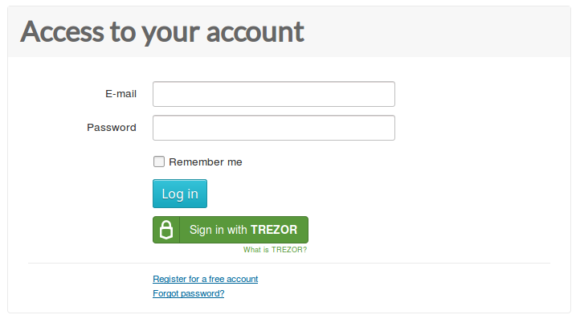

Osclass
=======

What is Osclass?
------------------

`Osclass <https://osclass.org>`_ is an open source platform that allows you to easily create a `classifieds site <https://osclass.org/showcase>`_ without any technical knowledge. 
Thanks to `TREZOR Connect plugin <http://market.osclass.org/plugins/security/trezor-connect_242>`_, admins can now add **Sign in with TREZOR** button to their sites with just a few clicks and
enable their users to login securely without password.

Sites using TREZOR Connect plugin
---------------------------------

Do you have classifieds site running on Osclass platform with TREZOR Connect enabled? Let us know about it at integration@satoshilabs.com, we will gladly include link to your site here.

Resources
---------

- `Website <https://osclass.org>`_
- `Plugin download <http://market.osclass.org/plugins/security/trezor-connect_242>`_
- `Plugin source code <https://github.com/conejoninja/osclass-trezor>`_

.. Installing the plugin
.. ---------------------

TREZOR User Manual
------------------

Before you can Sign in with TREZOR, you have to **link your TREZOR to your account**:
Login into your account and click on TREZOR device section in My account.

Connect your TREZOR, click on Sign in with TREZOR and confirm the action on your TREZOR.

Authenticate with your PIN. Note, that PIN is never asked again until you disconect and reconnect the device.

.. image:: images/coinpayments10.png

Finally, enter your account password to complete the procedure.

From now, you will be able to Sign in with TREZOR and **never again worry that your password might be stolen by a keylogger**. 
Go ahead and try it!

In case you ever need to **unlink your TREZOR**, you can do it easily in TREZOR device section of Account Settings.
