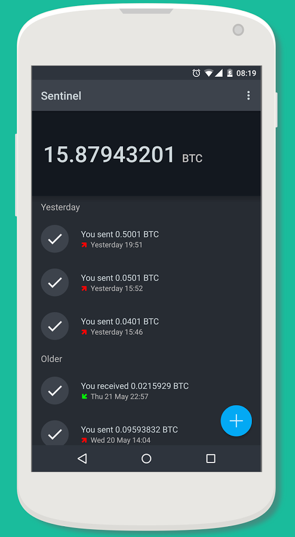

Sentinel
========

What is Sentinel?
-------------------------

`Sentinel <http://samouraiwallet.com/sentinel/index.html>`_ is an Android app which lets you safely watch over your TREZOR transactions.
Scan any of your account publics key (XPUB) and Sentinel will keep a close watch, alerting you of any new incoming transactions.
It also allows you to generate new receive addresses, so you can receive bitcoin payments directly into selected TREZOR account.
Sentinel cannot create transactions or send your bitcoins, it is only useful as a **watch only wallet**.

=================================================== =================== ===========================================================================================================
Wallet Property                                                         Description
----------------------------------------------------------------------- -----------------------------------------------------------------------------------------------------------
:icon:`laptop` Platform                 			✔                   Android
:icon:`money` Coin(s)                   			✔                   Bitcoin
:icon:`language` Languages                          ✔                   English                   
:icon:`eye-slash` Watch-only mode                   ✔                   Importing watch-only account and generating new receiving address
:icon:`bars` Multiple Accounts           								Capable of working with multiple accounts
=================================================== =================== ===========================================================================================================

Resources
---------

- `Website <http://samouraiwallet.com/sentinel/index.html>`_
- `Downloads <https://play.google.com/store/apps/details?id=com.samourai.sentinel>`_
- `Support <mailto:wallet@samouraiwallet.com>`_
- `Twitter <https://twitter.com/samouraiwallet>`_
- `Blog <http://blog.samouraiwallet.com>`_

TREZOR User Manual
------------------

To export your account, go to `myTREZOR.com <https://mytrezor.com>`_ and click on the name of your device.
In Basic settings, reveal your account public keys by clicking on Show XPUBs and select account for exporting.

.. image:: images/coinsimple-mytrezor01.png

Now install Sentinel app on your phone or tablet. When it opens, select Scan option and **scan QR code in MyTrezor corresponding to selected account public key**.
If your camera doesn't work, select Manual option instead and type the public key in. After you confirm it, Sentinel will download all transactions
related to the imported account.

You can get more infomation about particular transaction by simply selecting it from the list. To generate new receiving address, click on "+" icon at bottom right corner.
If you need to watch another account, click on the settings icon at upper right corner and select Your XPUB and import a new account public key. 

Currently Sentinel supports working with only one XPUB at a time.
