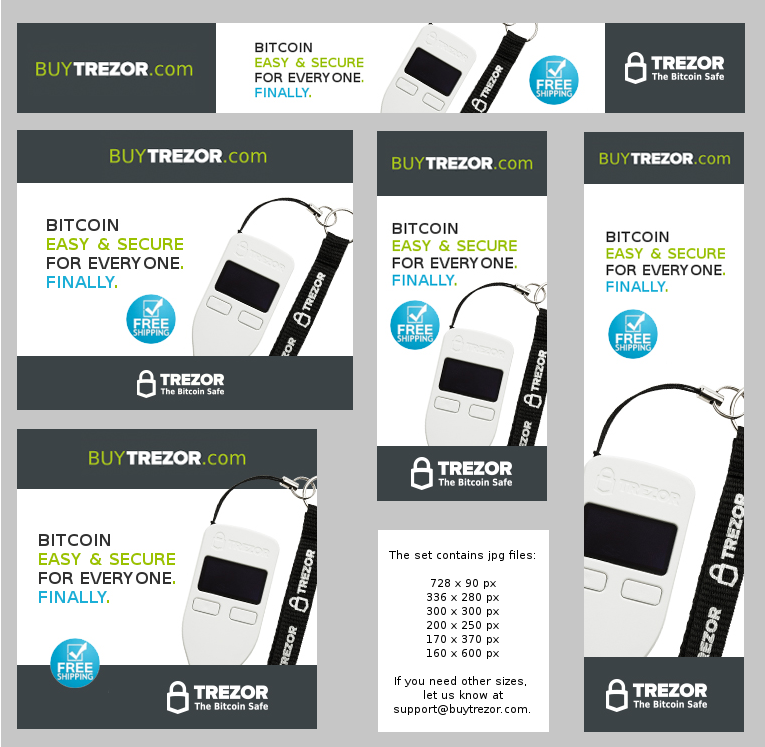

Affiliate Program
=================

Why should I join the affiliate program?
----------------------------------------

Our affiliate program let's you share the success of our product and earn bitcoins by promoting it, while at the same time you help to secure the Bitcoin world. You are free to refer your blog readers, site visitors, friends, etc.

Bitcoin is an emerging niche market and our product is currently one of the safest ways to store and use bitcoins. This in combination leads to a very high conversion rates if marketed correctly.

What's in it for me?
--------------------

Every sale referred by you can earn you up to 10% commission, depending on your rank in our affiliate system.

How do I become your affiliate?
-------------------------------

1. Apply for partnership via `our email <mailto:info@buytrezor.com>`_ with details about your marketing experience, and your promotion channels. We'll review your application shortly.

2. TREZOR users are the best source of recommendation and they love our product. That's why every BuyTrezor.com shopper automatically gets the chance to join our program. 

Where are the Affiliate Conditions?
-----------------------------------

You can download the Affiliate Terms and Conditions `here <https://www.buytrezor.com/static/shared/affiliate-conditions.pdf>`_ (pdf, 60 kB)

Where can I find useful information and updates about Trezor?
-------------------------------------------------------------

You are free to use any of the content found on these websites providing you link to the source of it.

`TREZOR User Manual <http://doc.satoshilabs.com/trezor-user/>`_ is a great place to find:

- precise information on how Trezor works
- a lot of screenshots and photos
- explanation of the Trezor security design and philosophy

Other great sources of information are:

- `TREZOR FAQ <http://doc.satoshilabs.com/trezor-faq/index.html>`_
- `BitcoinTrezor.com - product pages <http://www.bitcointrezor.com/>`_
- `Facebook pages <https://www.facebook.com/BitcoinTrezor>`_
- `Twitter <https://twitter.com/bitcointrezor>`_

User feedback:

- `reddit/r/trezor <https://www.reddit.com/r/trezor>`_

How to link correctly?
----------------------

**1. Use a link to buytrezor.com with your personal referral code after the "?a=":**
`https://www.buytrezor.com?a=referralcode <https://www.buytrezor.com?a=referralcode>`_

ALTERNATIVELY:

If you only use one source of traffic, for example your blog, you can `ask us <mailto:support@buytrezor.com>`_ to replace the referral code by your domain. In that case your referral code can be skipped and you can link to https://www.buytrezor.com directly. We will record all traffic and shopping coming from your domain.

**2. Simultaneously, you can use your email address as a referral code.**

1. The buyer will then either write your email address into the "**Promocode**" field in the Shopping Cart
2. or you can embed it into your referral link like this: `https://www.buytrezor.com?a=your_email_address <https://www.buytrezor.com?a=your_email_address>`_

Where can I find a logo of TREZOR?
----------------------------------

In our `Press Kit <https://github.com/satoshilabs/presskit/archive/master.zip>`_, together with other logos of our projects, photos of our team and our bios. Feel free to use any of them or ask us for more.

Which banners can I use?
------------------------

You can `DOWNLOAD ALL BANNERS IN ZIP <https://buytrezor.com/static/shared/trezor_banners.zip>`_ and also use the banners we put up temporarily with some special promotion.
You can also create your own banners, but please send them to us for approval before you start using them. Thanks!

**Preview of Set 1. Finally Easy & Secure - white**

I see some rewards but I didn't receive any BTC yet. Why?
---------------------------------------------------------

Your reward has to reach the Payout Threshold in order to be processed.
Current Payout Threshold is 0.1 BTC. 

Also, the rewards are waiting for at least 35 days to get `Confirmed <https://www.buytrezor.com/user/profile/affiliate/#what-are-confirmed-rewards>`_.

After your rewards turn to Confirmed and reach the payout threshold, we manually verify and send your reward to your Payout address.

How do you calculate my rewards?
--------------------------------

We calculate your rewards as a percentage from the final sales price in BTC at the moment of the purchase. Your current percentage is shown in the Summary on this page as *Commissions (%)*.

On rare occasions you might see a negative Reward in your Transaction history. This happens when a client returns the order and requests a refund.

What are Confirmed rewards?
---------------------------

Confirmed Rewards are Rewards for non-cancelled and non-refunded Orders older than 35 days.
We are waiting for 35 days because the clients have a no questions asked return right that can be applied during 15 days after receiving their order. The delivery usually takes between 2 days to 2 or 3 weeks.

What are Total pending or Unconfirmed Rewards?
----------------------------------------------

**Unconfirmed Rewards** are Rewards for Orders waiting for 35 days to reach their maturity and turn to Confirmed Rewards. After turning Confirmed, they can be sent to your Payout address. 

**Total Pending Rewards** is a sum of Confirmed and Unconfirmed Rewards that accumulate on Affiliate's Account waiting for your payout date.
