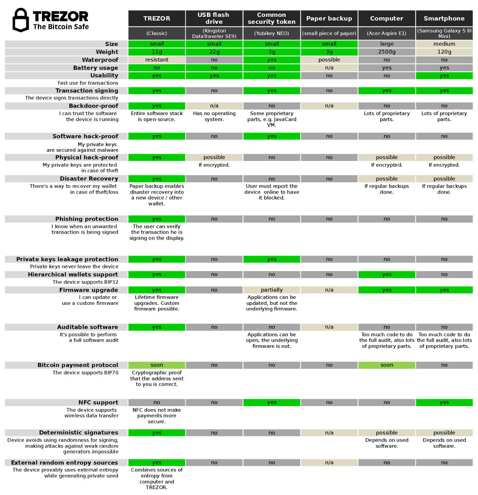

How is TREZOR different from ...
================================

an ordinary Web Wallet?
-----------------------

When you store your Bitcoins in a traditional web wallet you put your Bitcoins at risk of being stolen, lost, or confiscated.  Here is a list of ways people have lost their Bitcoins through use of a traditional web wallet:

 - User's computer is hacked and web wallet password is stolen

 - Web wallet server gets hacked and bitcoins are stolen

 - Web wallet company goes bankrupt

 - FBI or other enforcement agency confiscates coins

 - Web wallet provider points to ToS violation and takes coins

 - Owners of web wallet company run away with coins

 - Bug in web wallet software leads to loss of coins

 - Your computer or cell phone is stolen while you are logged in and thieves then steal your coins

If you keep your Bitcoins in a TREZOR, none of these things can happen.

a desktop Bitcoin client?
-------------------------

If you keep your Bitcoins in your computer, when your computer is hacked or stolen your Bitcoins can be stolen.

your mobile phone?
------------------

There are a number of programs that will allow you to send bitcoins from your mobile phones.  Some are simply mobile interfaces to web wallets, and suffer from the same flaws.  Some are the same as desktop clients, and can suffer from malware or theft.

a USB flash drive?
------------------

A USB flash drive is just storage for private keys. It means that when you want to make a transaction, you must attach your drive to the computer and let your bitcoin software read the keys from the device. At this point your private keys are accessible to viruses and malware, just as to any other software on your desktop computer.

On the contrary, TREZOR is a single-purpose computer, which stores your private keys and actively signs transactions without sending your private keys to the computer. When you want to make a bitcoin transaction, your bitcoin software just sends a transaction template to the TREZOR device and asks for a digital signature. TREZOR shows the requested amount and target address on its display. You will then confirm the transaction by pressing the hardware button. TREZOR will sign transaction internally and send the digital signature back to the computer, without leaking your private keys. Thanks to this, you can use TREZOR even on a vulnerable or hacked computer.

an encrypted wallet?
--------------------

Even using a strong password doesn't prevent viruses to silently sit on your computer and wait until you want to transfer coins out of your wallet. This is a vulnerable point, because a virus has access to the wallet file and can read your passphrase from your keyboard.

On the contrary, TREZOR never sends private keys to the computer, because when you want to send some coins out of your wallet, TREZOR asks bitcoin software for payment details, signs the transaction internally and then sends back just a digital signature of the transaction. There's no point where malware on your computer could access the private keys or send away your coins without your permission.

Yubikey?
--------
There is a significant difference between the two. The Yubikey is a device which helps the service to verify that it is actually you who is signing the transaction. However, it does not protect you against signing a different transaction than you intend to.

a paper backup of my keys?
--------------------------

A paper backup is a quite safe method to protect bitcoins, but you still need to load private keys from paper using a trusted computer to send your coins to somebody else.

Comparison Table
----------------

