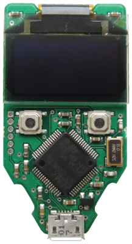

Hardware design & security
==========================

What are the technical parameters of the case?
----------------------------------------------

TREZOR case has dimensions of approx. 59 x 30 x 6 mm. It is made of a reinforced plastic providing a great durability.
  

Can I plug TREZOR into USB 3.0 (blue) port?
-------------------------------------------

TREZOR is USB 2.0 compatible device. Therefore it will also work properly when plugged into USB 3.0 as they are back compatible.

What kind of hardware specs does the TREZOR have?
-------------------------------------------------

**CPU**
  TREZOR is using a 120 MHz embedded ARM processor (Cortex M3 to be precise) with a custom developed system.

**Screen**
  Bright OLED - 128x64 pixels. Enough to hold six lines of text. Can display all the details you need to verify a transaction in a single screenfull.

**Case**
  Both TREZOR Classic and TREZOR Metallic will have a similar case with dimensions of approx. 60 x 30 x 6 mm. The Classic edition is made of a reinforced plastic providing great durability. The Metallic TREZOR is made of a polished CNC milled aluminum.

**Safety and certifications**
  The TREZOR is CE and RoHS certified, so it meets all quality, reliability and environmental standards. Its fine to take your TREZOR with you on the airplane. Like all modern electronics, the X-Rays won't hurt it.

**Operating temperature**
  -20°C to +60°C (-4°F - +140°F)

Why does TREZOR not have a fingerprint reader?
----------------------------------------------

We believe adding a biometric finger scanner to the device would decrease its security. There are ways to hack the fingerprint reader already (`apple iphone hacked <http://www.theguardian.com/technology/2013/sep/22/apple-iphone-fingerprint-scanner-hacked>`_).

Is the display of TREZOR big enough to show the entire address?
---------------------------------------------------------------

Yes, the display is an OLED with 128x64 pixels, big and bright enough to show clearly the entire payment address.

Is it safe to get TREZOR through the airport check?
---------------------------------------------------

Yes, TREZOR is just as any other type of common electronics, so no harm should be done by X-raying it.

Is TREZOR heat & cold resistant, waterproof?
--------------------------------------------

Yes, but we advise you not to expose TREZOR to temperatures lower than -20°C or higher than +60°C  (-4F +140F). The device is NOT waterproof. 
