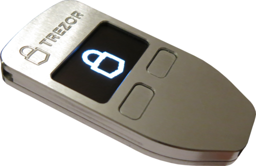
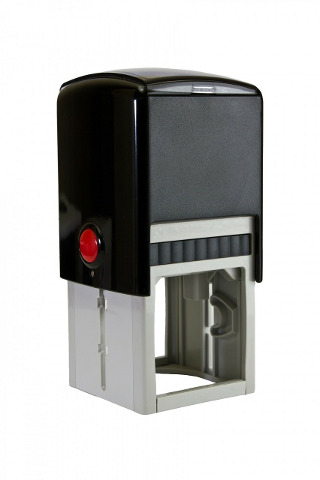

Product Overview
================

What is TREZOR?
---------------

TREZOR is a single purpose device which allows you to make secure Bitcoin transactions. With TREZOR, transactions are completely safe even when initiated on a compromised or vulnerable computer.  Because the use of TREZOR is very easy and intuitive we believe it will help Bitcoin adoption among people not familiar with the security issues.

How does TREZOR work?
---------------------

The Bitcoin protocol works by sending signed notes of payment across the Internet. These messages (which are referred to as Transactions) are signed using a special algorithm. In order to sign a Bitcoin transaction you need to have a special key or password. TREZOR holds that key. Since TREZOR's job is to help you securely sign Transaction messages, you can think of you TREZOR as a modern day stamp.

(image credit  `Petr Kvashin <http://www.publicdomainpictures.net/view-image.php?image=038943>`_)

TREZOR is better than an ordinary mechanical stamping mechanism, however. Each TREZOR has a PIN code. If your TREZOR gets stolen, thieves cannot misuse it to steal your money. Due to TREZOR's clever design, even if the computer with which you use your TREZOR is hacked, the hackers will never know your PIN.

In contrast to the various pieces of software and web services that allow you to store your Bitcoins TREZOR is secure. Software and web based solutions keep your Bitcoin signing keys either on your computer, or worse, on the Internet! When you use such a service, hackers can easily steal your Bitcoins by hacking your computers or hacking the servers of the services that you use.

Which operating systems and devices support TREZOR?
---------------------------------------------------

There is full support in Windows, OS X (version 10.8 and higher) and Linux. Support for using your TREZOR with Android devices which have USB On-The-Go (aka USB Host) support is planned in a future release.

Which wallets are compatible with TREZOR hardware?
--------------------------------------------------

These wallets can communicate with TREZOR hardware and use its full potential.

- `myTREZOR <http://www.mytrezor.com>`_
- `Electrum 2.0 <https://electrum.org/>`_
- `Multibit HD <https://multibit.org/>`_
- `GreenAddress.it <https://greenaddress.it/en/>`_
- Armory support planned
- BitPay's Copay support planned

Which wallets are compatible with TREZOR recovery seed?
-------------------------------------------------------

These wallets cannot communicate with TREZOR hardware yet, but you can use them to access your funds using TREZOR recovery seed.

- `Mycelium Bitcoin Wallet for Android <https://play.google.com/store/apps/details?id=com.mycelium.wallet>`_ - supports full recovery
- `Mycelium Bitcoin Wallet for iOS <https://itunes.apple.com/us/app/mycelium-bitcoin-wallet/id943912290>`_ - supports 12 words recovery only (18 and 24 words soon)
- `Wallet32 for Android <https://play.google.com/store/apps/details?id=com.bonsai.wallet32>`_ - supports full recovery

Which watch-only wallets can import TREZOR account public keys (xpub)?
----------------------------------------------------------------------

These wallets cannot operate with your funds, but you can use them to watch transactions and generate receive addresses for your TREZOR accounts.

- `myTREZOR Lite (Android) <https://play.google.com/store/apps/details?id=com.satoshilabs.btcreceive>`_
- `Coyno (web) <https://beta.coyno.com/>`_
