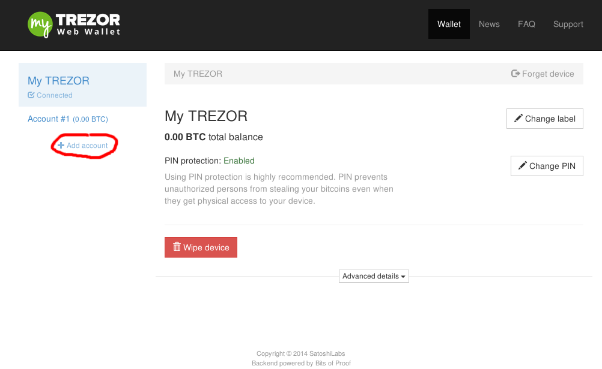

Using multiple accounts
-----------------------

Your TREZOR can manage multiple bitcoin accounts.  This allows for easier tracking of bank balances and for managing your bitcoin identity.  All bitcoin transactions are publicly available on the internet.  It is not, however, public who controlls a given bitcoin account.  Common account separations would be having one account for personal use and one for business use and one for purchases that you wish to keep private. If you frequently send bitcoins between accounts then it may become clear that you are the owner of both.  For this reason, we consider this privacy feature to be useful mainly to advanced users.

Creating a new account is easy.  Just press the add account button at the bottom of your accounts list:

.. note:: The add account button will be dissabled untill you have sent some bitcoins to your last account.

