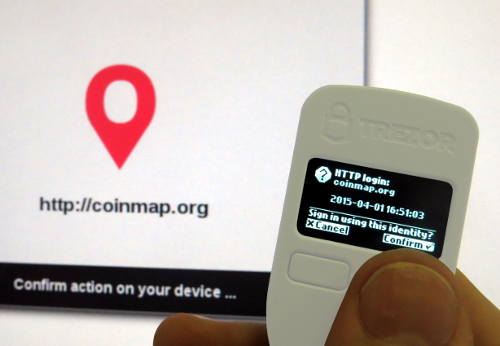

TREZOR Connect API
==================

Add TREZOR Login to Your Website or App

.. image:: images/connect-login.png

TREZOR Connect is a platform for easy integration of **Login with TREZOR** into websites or applications. 

TREZOR is known as the most secure bitcoin hardware wallet. TREZOR Connect expands its application to the most secure user authentication device. It allows a **password-less login immune to keyloggers or phishing** that provides a simple fluid interface for users with basic computer skills. 

Within the first 4 months since official release, the device was embraced by users in over 70 countries and greatly reviewed by security experts as `the most sophisticated authenticator device in the world <http://www.coindesk.com/whats-next-bitcoin-wallet-security>`_

Learn more about the `TREZOR Security and Login with TREZOR <http://satoshilabs.com/news/2015-04-07-trezor-firmware-1-3-3-connect-api>`_ before implementing this API.

How it works
------------

After you implement TREZOR Connect into your web page, the following button will appear:

.. image:: images/connect-button.png

When user clicks on the button, the following dialog windows will popup:

.. image:: images/connect-screen.png

and TREZOR will show the following confirmation screen:

After user confirms the action, the device will return a structure with signed login information. Your backend service just needs to check the signature against user's public key.

How to implement
----------------

The implementation is fairly simple and straightforward. For full description see `our repository <https://github.com/trezor/connect>`_

Implementation and security considerations
------------------------------------------

TREZOR Connect leverages the ability of TREZOR device to hold securely secret keys and use them to sign messages without actually ever exposing these secrets. Thus when using login with TREZOR, no user password is needed and no reusable secret can be ever captured by keylogger or other malware.

To gain the maximum security from TREZOR Connect the site should make the implementation correctly without any unintented backdoors. There are the following basic scenarios:

**Sign in with TREZOR only** (use case A)

This is the most secure option: When user Sign in with TREZOR for the first time, the site offers him to create new account with his site-specific TREZOR identity.

There is no other way how to login and site operator should decide carefully if he allows any other (usually much weaker) form of authentication and TREZOR identity override.

**Classic sign in along with TREZOR option** (use case B)

This case occurs when TREZOR is only one of more ways of accessing user account. Usually user already has an account with username-password authentication and he pairs TREZOR with his account later.

With this option, user doesn't have to expose his orginal credentials each time he authenticates. Nevertheless, he can still easily recover access to the account using username & password if his TREZOR identity gets lost.

Site can also give user an option of disabling the original credentials, thus effectively creating the first use case.

.. important:: Pairing TREZOR with user's account create new way of accessing it. The site should always authenticate the user before confirming the action.

**TREZOR identity recovery**

Users are instructed to keep their recovery seed safe and offline. Thus in the event of lost device, user will still be able to login with TREZOR after he recovers the seed on a new device. He may also use recovery and login through software, although the login through software means is not supported by TREZOR Connect at the moment.

Nevertheless, there will be also rare cases of users who will loose both device and recovery seed. Therefore the site operator could carefully consider reasonable and solid ways of TREZOR identity override to enable the user to access his account even without his TREZOR.
