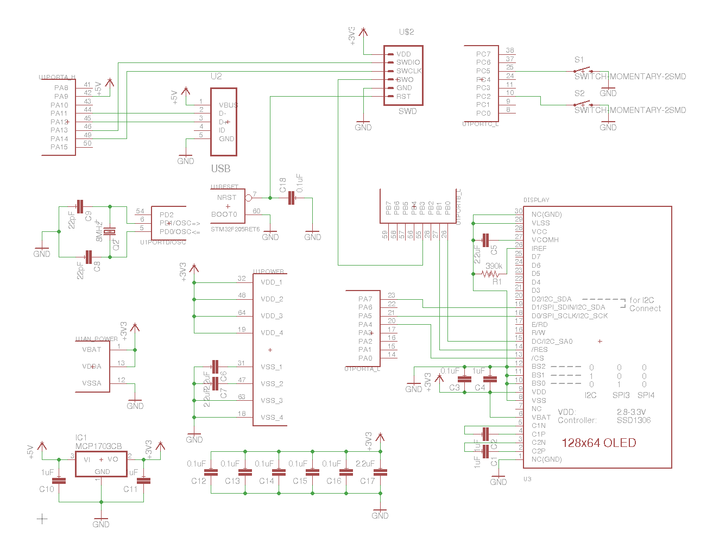

Hardware
========

Board
-----

.. image:: images/trezor-pcb.jpg

Schematics
----------

Bill of Materials
-----------------

* 5x SMD 0603 Capacitor 1uF - C1, C2, C4, C10, C11
* 7x SMD 0603 Capacitor 0.1uF - C3, C12, C13, C14, C15, C16, C18
* 3x SMD 0603 Capacitor 2.2uF - C6, C7, C17
* 1x SMD 0603 Capacitor 4.7uF - C5
* 2x SMD 0603 Capacitor 22pF - C8, C9
* 1x SMD 0603 Resistor 390k - R1
* 2x Microbuton P-B17310
* 1x Micro USB (type B) Receptacle Bottom
* 1x OLED display 128x64 UG-2864HSWEG01
* 1x STM32F205RE
* 1x MCP1703 Low Dropout Voltage Regulator
* 1x ABMM2 8 MHz Crystal
