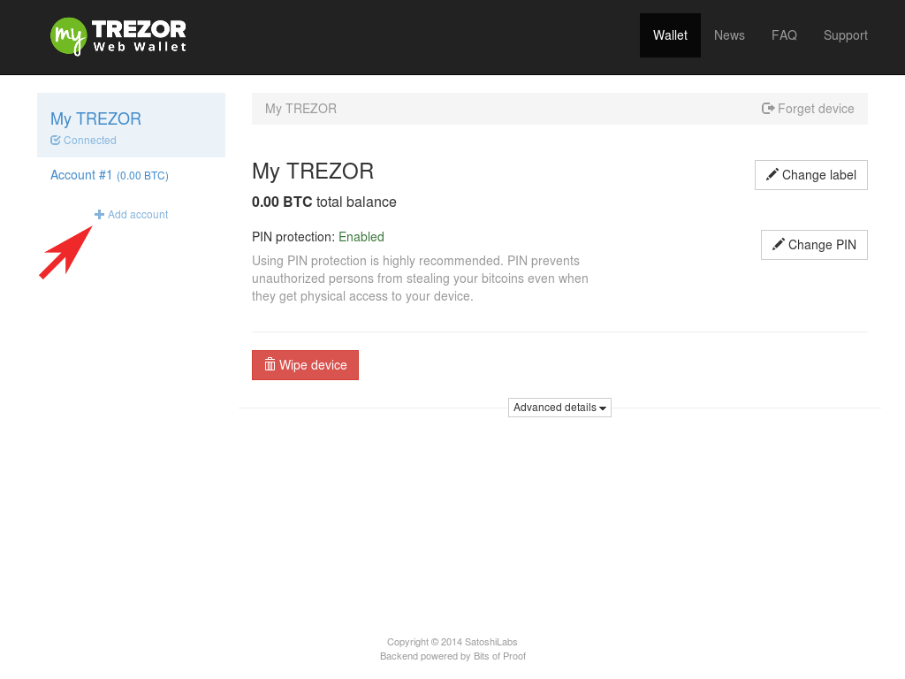
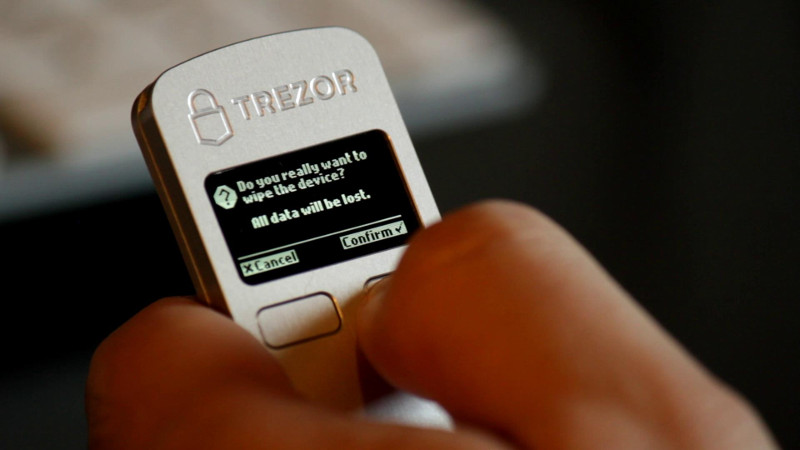

Advanced features
=================

Using multiple accounts
-----------------------

Your TREZOR can manage multiple bitcoin accounts.  This allows for easier tracking of bank balances and for managing your bitcoin identity.  All bitcoin transactions are publicly available on the internet.  It is not, however, public who controls a given bitcoin account.  If you want to keep some of your transactions private, then you will need to manage multiple accounts.  A common account separation would be to have three accounts:

 - personal use
 - business use
 - private purchases

If you frequently send bitcoins between accounts then it may become clear that you are the owner of both.  For this reason, we consider this privacy feature to be useful mainly to advanced users.

Creating a new account is easy.  Just press the add account button at the bottom of your accounts list:

.. note:: The add account button will be disabled until you have sent some bitcoins to your last account.

Wiping your TREZOR device
-------------------------

1. Plug in your TREZOR
2. Go to myTREZOR.com
3. Select your TREZOR and press **Wipe device**

 - You should now see the "Welcome to TREZOR Setup!"

Changing your TREZOR recovery seed
----------------------------------

You can change your recovery seed given that you are still in possession of your TREZOR recovery card.  However, doing so safely is a multi-step process.  Be sure to follow the instructions carefully.

.. warning:: Do not simply transfer your coins outside of your TREZOR! They may be stolen, even if they are on a non secure device for a very short time.

In order to change your recovery seed, you will need:

 - Your TREZOR device
 - Your recovery card
 - Blank piece of paper
 - Pen or pencil

Now do the following steps:

A. Wipe your TREZOR device (see above)

B. Setup your TREZOR with its new recovery seed and write down your new TREZOR's address

 1. Run TREZOR setup on your TREZOR
 2. Go to the **Account 1** page and select the **Receive** tab
 3. Write down the address of your new TREZOR account

C. Select your TREZOR and press **Wipe device**

D. Recover your TREZOR back to the old recovery seed and send your bitcoins to your new TREZOR account

 1. Run the :doc:`Recovery process <recovery>`
 2. Once your old TREZOR is recovered send your bitcoins to the new TREZOR account whose address you wrote down in step B.

E. Select your TREZOR and press **Wipe device**

F. Recover your TREZOR using your new recovery seed

G. Done!
