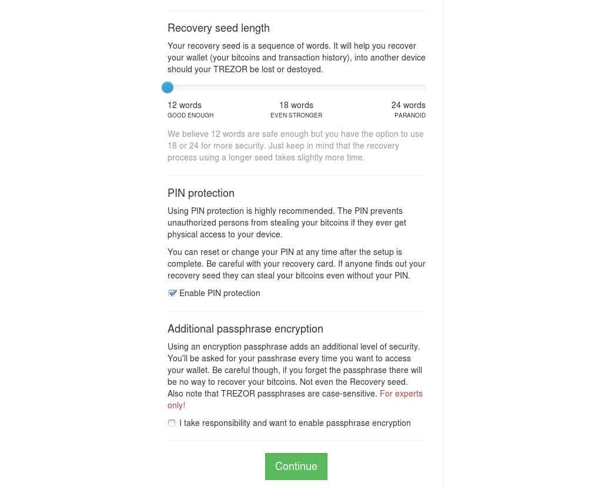

Advanced settings
=================

There are several advanced settings that can be configured after setting up your TREZOR device.  For the most part, these settings can be accessed by pressing the "Advanced settings" button right after you have plugged your TREZOR.

Disable PIN protection
----------------------

It is possible to disable PIN protection using the Disable PIN button, however we do not recommend to do so, as  PIN protection reduces the risk that a person with physical access to your TREZOR device will be able to steal your bitcoins. MyTREZOR.com will ask you for your PIN the first time you try to make a transaction after plugging in your TREZOR and it works in such a way that even the computer you use with your TREZOR never finds out your PIN.

.. warning:: We DO NOT recommend to DISABLE PIN PROTECTION even if you have configured a passphrase for your TREZOR!

Using passphrase encrypted seeds
--------------------------------

In addition to a PIN it is possible to add a passphrase to your TREZOR.  This has the advantage of making your TREZOR impervious to physical attack.  Even if your TREZOR were to be stolen and the chip examined under an electron microscope to discover your recovery seed, your bitcoins would still be safe!  A passphrase can be any word or any set of letters that you might use as a password.  Your passphrase should be memorable though.  You typically would not write it down anywhere, to eliminate any possibility of it being discovered.

One limitation of the passphrase approach is that you have to enter your passphrase into the computer that you use with your TREZOR.  For this reason, you should not be tempted to disable your PIN even if you use a passphrase as well!

The flip side to this extreme level of security is that if you forget your passphrase your bitcoins are lost.  Really lost!

.. note:: If you have stored some funds in your TREZOR before setting up the passphrase encryption, they will not appear after enabling the passphrase. But don't worry, they are not lost. You can  access them by entering empty passphrase.

Multi-passphrase encryption (hidden wallets)
--------------------------------------------

Security researchers have a habit of coming up with spicy names for simple attacks.  One such attack is referred to as the $5 wrench attack.

.. image:: images/5-dollar-wrench.png

(Image credit: `Randall Munroe xkcd.com <https://xkcd.com/538/>`_. Used under the terms of the Creative Commons Attribution license)

If you have your passphrase memorized and you haven't written it down anywhere, attackers with physical access to your TREZOR may still be able to extract the passphrase with a $5 wrench.   In order to mitigate this risk it is possible to set up your TREZOR multiple times with multiple passphrases.  The goal is to have one "spoof" setup that only holds a few bitcoins or bitcents and one "real" setup that holds your fortune.

In order to do this all you need to do is setup your TREZOR with a passphrase, then unplug and replug your TREZOR and enter a different passphrase.  Here's an example:

I setup my TREZOR with the passphrase "lonelypumpkins" and load a large number of bitcoins onto my device.  I unplug/replug my TREZOR and enter the passphrase "funnyspirit".  I then send a few bitcents to the "funnyspirit" account.  When the thugs come and steal my TREZOR, I can now safely tell them that my passphrase is "funnyspirit".  They will be able to steal a few bitcents from me, but they won't be able to get at my fortune or even determine that a second passphrase exists.

.. note:: Do not use either the passphrase "lonelypumpkins" or "funnyspirit" to secure your TREZOR device!
