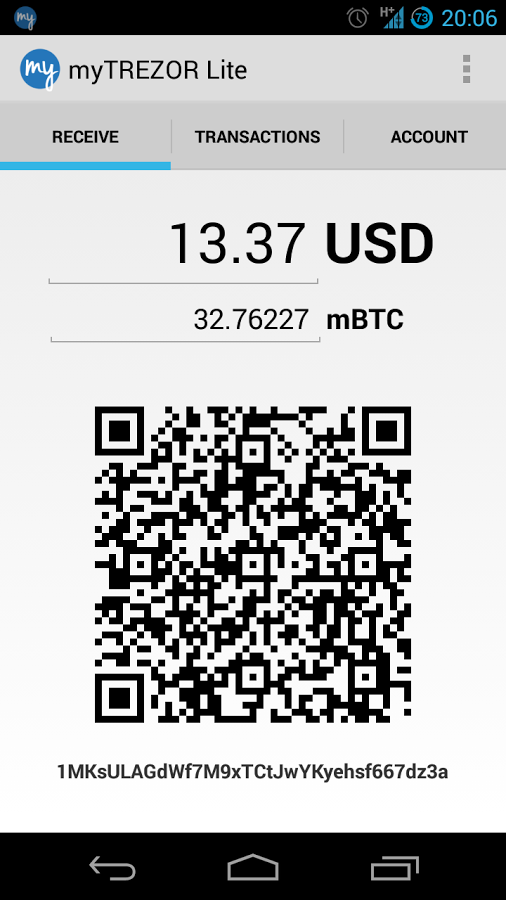

Applications
============

myTREZOR Lite for Android
-------------------------

This application allows you to accept Bitcoin payments which will appear in your myTREZOR wallet without the need of carrying your TREZOR device around. You can also view the transaction history and individual addresses with their balances.

You can download it from `Google Play Store <https://play.google.com/store/apps/details?id=com.satoshilabs.btcreceive>`_

To start using it:

1. Go to https://mytrezor.com/ website
2. Select your TREZOR device
3. Click on Advanced details
4. Scan the XPUB QR code of the desired account into myTREZOR Lite application

.. image:: images/mytrezor-lite_transactionhistory.png
