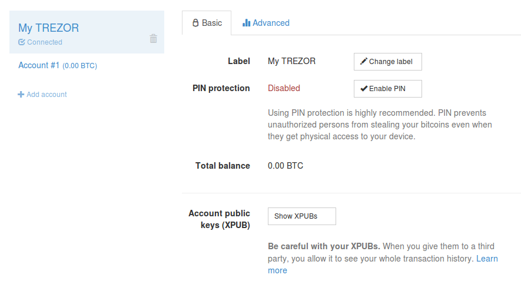

Basic Settings
==============

After clicking on Basic tab, you can see following screen:

On this tab you can change the label of your device, enable / change PIN, see the Total Balance and also view the XPUBs (Account public keys) of your accounts.

Changing label
--------------

You can easily change the label of your device just by clicking on Change Label button. You will be asked to confirm such action by pressing button on your TREZOR (and your PIN if you have PIN set up already).

Enabling / Changing PIN
-----------------------

To see detailed description on how to chose and enter your PIN you can have a look here :doc:`Entering your PIN card <enteringyourpin>`.

Total Balance
-------------

Total Balance of the entire wallet is visible here. Entire wallet means all accounts and addresses. 

.. note:: If you have set up multiple wallets using passphrases, only balance of the current wallet (using current passphrase) is visible. More details about using passphrases in :doc:`Advanced Settings <advanced_settings>`.

Viewing XPUBs
-------------

Account public keys let you view your accounts and generate new receiving addresses even when your TREZOR is disconnected.
