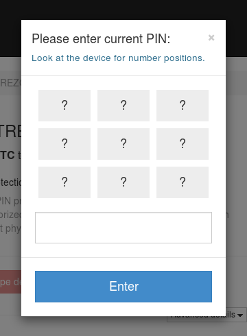
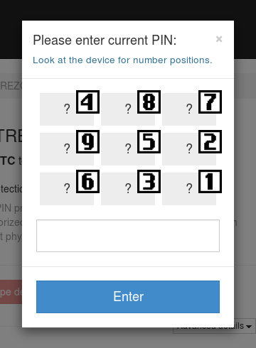

Entering your PIN
=================

You can use your TREZOR safely with any computer, even one you don't trust.  But you don't want to go entering your PIN into untrusted computers and ATMs.  We invented a new method of entering your PIN, one that is both convenient and highly secure:

Don't worry!  It is not as hard as it looks.  Each one of those dots is a button, just like the number pad on an ATM.

Now look down at your TREZOR.

.. image:: images/trezor-pin.jpg

If you hold your TREZOR up to your computer's screen, you can see that for every dot, the TREZOR shows you a random number.  The numbers on your TREZOR tell you what each of those buttons mean.  Taking the picture above as an example, the first dot on the computer's screen is the '4' button.  The second dot on the first row is the '8' button and so on.

So if you were to copy the numbers from your TREZOR's screen onto the dot pad in myTREZOR it would look like:

Now entering your PIN should be easy!

Choose a good PIN
-------------------

If you are not sure about what PIN to use, you may want to overview our :doc:`security best practices <securitybestpractices>`.

.. important:: When you are setting up your TREZOR for the first time, you'll have to enter your new PIN twice.  Notice that the numbers shown on TREZOR change between the entries.

You'll then need to enter this same PIN each time you are about the do the first transaction using your freshly plugged-in TREZOR.

- Continue to :doc:`receivingpayments`

- Continue to :doc:`makingpayments`

- Continue to set up :doc:`advanced_settings`
