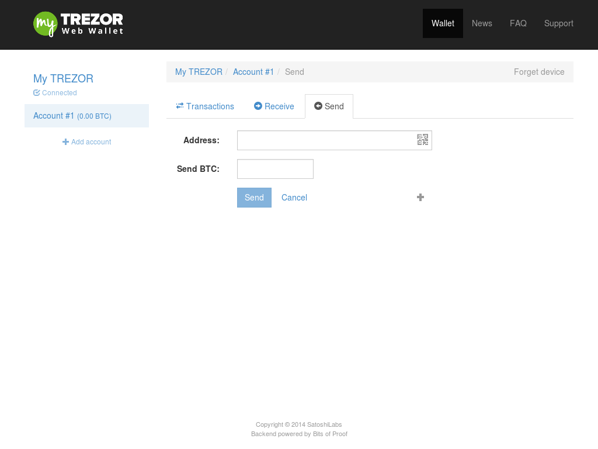
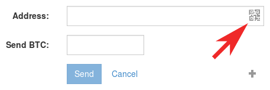
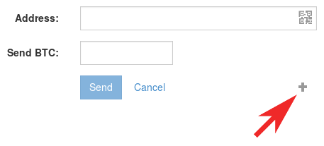
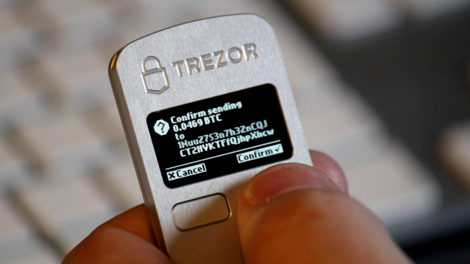
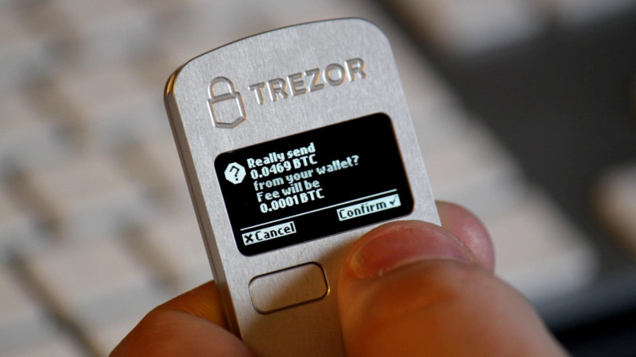

Making payments
===============

In order to make payments, go to the account page in myTREZOR and press send.  You should see a payment page like this:

**1. Enter the destination address**

You can type in a destination address for your transaction and the value of coins which are about to be sent. Now you can choose to insert the amount in Bitcoins or any other world currency (actual exchange rate is provided by CoinDesk).

If the address you want to send to is on someone's cell phone, you might not want to type in the full address.   Chances are though, that they'll also be able to show you the QR code for their account.  You can scan a QR code with myTREZOR simply by pressing the scan QR code button in the address field and holding a picture of the QR code up to your computer's web cam.

You can send bitcoins to multiple addresses with one transaction by pressing the '+' button in the right hand corner of the Send page. You can also choose to add multiple transactions by clicking on the "Import from CSV" button.

This is both convenient and saves you money in transaction fees.

**2. Enter your PIN**

The first time you make a payment with your TREZOR after plugging your TREZOR in, you must enter your PIN.  This is because each time you plug in your TREZOR, your TREZOR starts in a locked state.  Once you have entered your PIN for the first time, your TREZOR will be unlocked until it is unplugged again.  If you need help entering your PIN, please see :doc:`entering your pin<enteringyourpin>`.

**3. Confirm the transaction on your TREZOR**

Once you have press send and entered your PIN, you will be asked to confirm your transaction.  Check the amount of the transaction and the destination address.  If the amount and address are correct, press the right button on your TREZOR to confirm.  If they are wrong, press 'cancel'.  If they are wrong, it may mean that your computer has been infected with a virus and you can be happy that your bitcoins are safe in your TREZOR, and not already stolen.

Once you have confirmed the destination address(es) and amount(s) of your bitcoin transaction, your TREZOR will display the total amount of the transaction along with the transaction fee.  Again, check to make sure these are reasonable before pressing confirm.

.. note:: Each time you send bitcoins you have to pay a small transaction fee.  This fee will be automatically calculated for you by the myTREZOR wallet and charged against your account.  This fee goes to funding the running of the bitcoin network and is not charged by SatoshiLabs.

Outgoing transactions
---------------------

You can watch the progress of your outgoing transactions by switching over to the **Transactions** window.  Outgoing transactions are marked as red.
