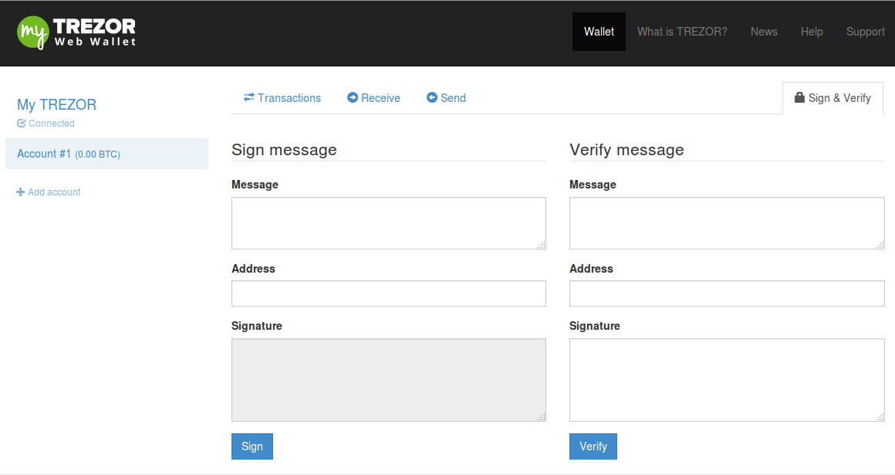
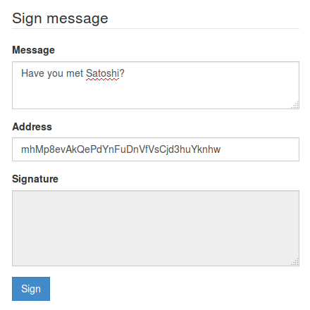
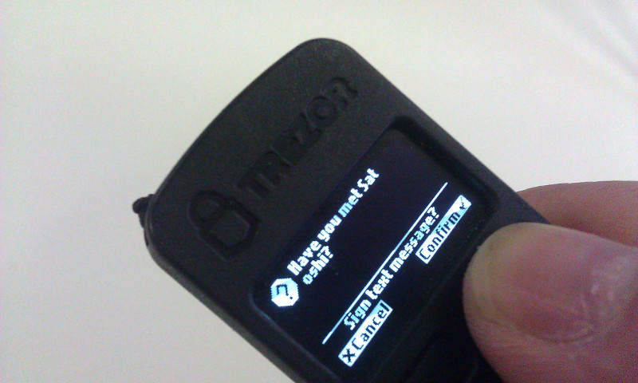
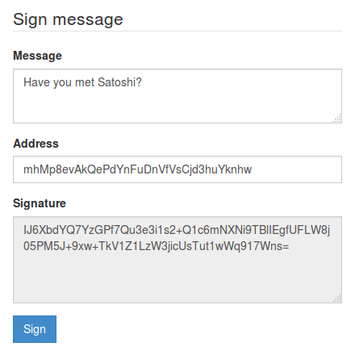
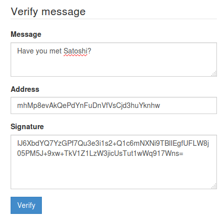
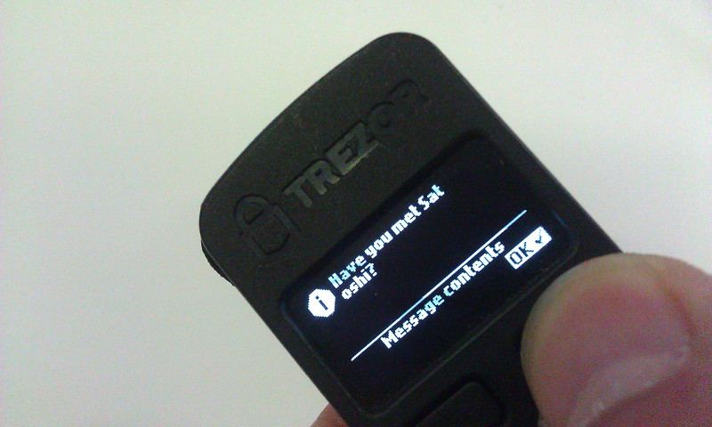
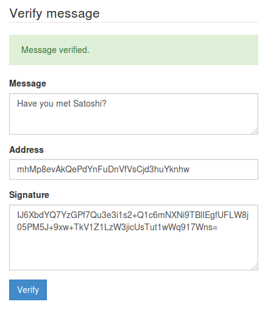

Messages
========

Signing messages
----------------

Signing messages can be used to prove ownership of a specific bitcoin address.

A common situation where this might be handy is:
You have your bitcoin exchange account protected with 2FA, but you lose access to your 2FA tool (mobile phone, email). To get your account unlocked, you can be asked by the exchange operator to sign some message with that bitcoin address asociated with your exchange account.

In order to sign a message, select the Account in myTREZOR.com and press Sign & Verify in the right top corner.  You should see a payment page like this:

**1. Signing the message**

Type in the message text into Message field, then copy & paste the particular bitcoin addresses into the Address field (note it has to be a **used** address) and confirm with clicking on "Sign".

**2. Confirming the signature on your TREZOR**

Check the text of the message on your TREZOR's diplay. If the text is correct, press the right button on your TREZOR to 'Confirm'.  

Once you have confirmed the signature on your TREZOR, the signature will appear on the screen:

Verifying messages
------------------

In order to verify message, select the Account at myTREZOR and press Sign & Verify in the right top corner. You should see a page like this:

**1. Verifying a message**
 
Copy & paste the signed message into the Message field, then paste the bitcoin address the message has been signed with into the Address field, and finally paste the signature into the Signature field. 
Click on 'Verify'.

**2. Validating on TREZOR**

TREZOR should show the beginning of the message on it's display, if verified correctly. Otherwise, you will get an error message on myTREZOR page.

Once you have confirmed the verification on your TREZOR, a "Message verified" will appear on your computer screen:

