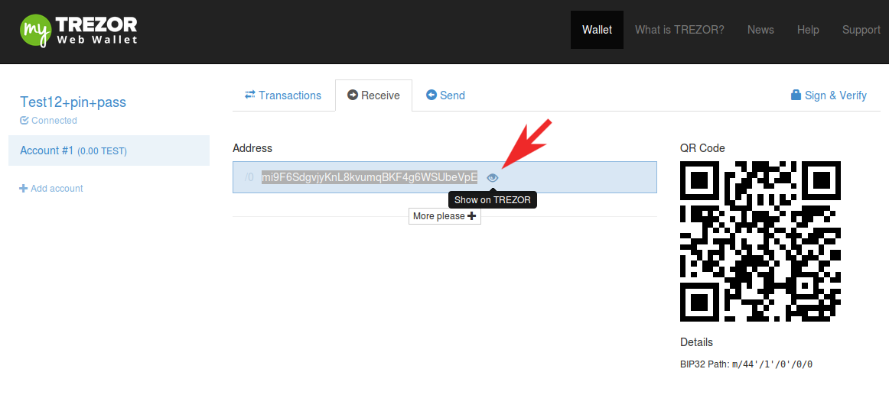
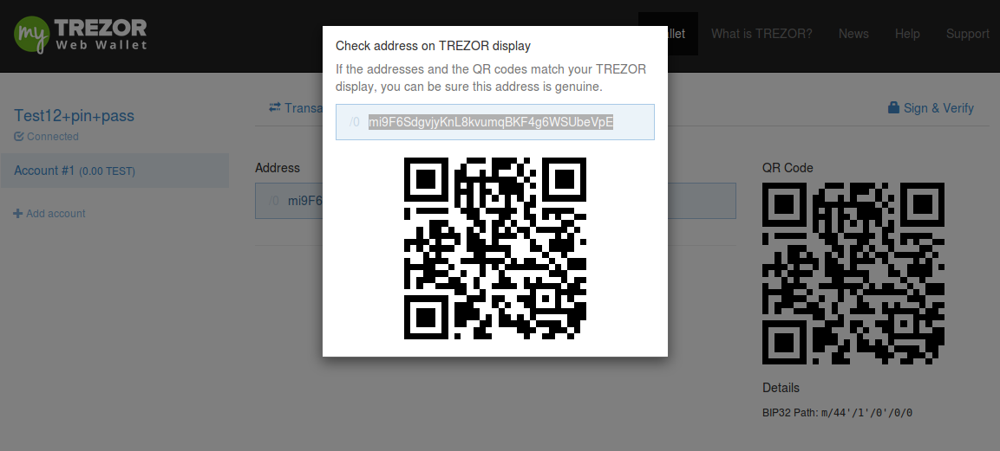
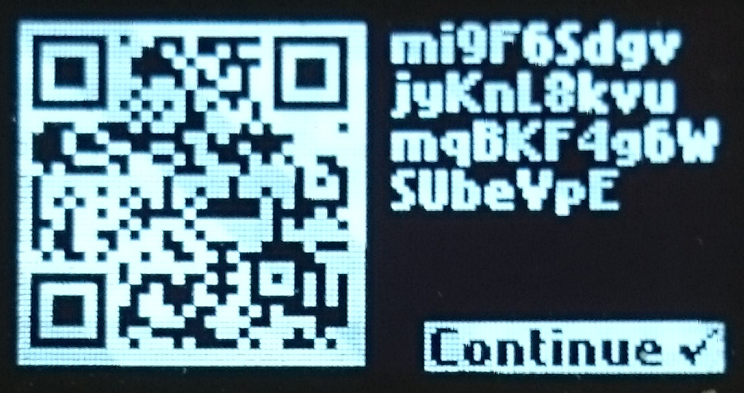

Receiving payments
==================

Once you've initialized your TREZOR, your wallet is ready to be used. You should now see a screen like this:

.. image:: images/emptywallet.png

By clicking on "Account #1" you will see an empty Transactions tab.

Now it's time to transfer your bitcoins to the safety of your TREZOR. Select the Receive tab to get your first TREZOR bitcoin address. A bitcoin address is a long string of numbers and letters. If you are transfering bitcoins from a mobile wallet, scan the `QR code`_ shown next to the address.

Watch out for the "eye" icon!
It might help you avoid phishing attempts aimed at replacing your true receiving address. We call this feature "**Show on TREZOR**" as it displays the receiving address on your device.

.. warning:: Always make sure the receiving address is created by your TREZOR and not by a hacker who tricked your browser into showing a fake website with a fake receiving address.

Here's an example of what you see on your TREZOR display after clicking "Show on TREZOR".

You may also use the "More please +" button to create more receiving addresses. Why would you want more addresses? Say you use the first address to receive your salary. You can tell when your employer has payed you because you receive bitcoins on that address. Now, you want to sell your lawnmower to Bob. How do you know when Bob has payed you and which payment came from Bob? You can create a new bitcoin address specially for Bob. When bitcoins come in to that address you know that its Bob paying you and not your employer.

.. hint:: Also read about using `multiple accounts <http://doc.satoshilabs.com/trezor-user/advanced_features.html#using-multiple-accounts>`_ for better privacy

Confirming that a payment has been received
-------------------------------------------

When someone makes a payment to you, you will see a green(incoming) transaction appear in the transactions pane.

.. image:: images/tx-incoming-unconfirmed.png

At first, the transaction will be marked as "unconfirmed".  If a transaction is small and from a known person, it is safe to assume that the transaction will be confirmed by the transaction network successfully. However, if the transaction is large or coming from an untrusted party you should be more careful and wait for the transaction to get "confirmed". Transactions can take up to 15 minutes to go through completely. When they do so, you will see the "unconfirmed" text replaced by the date and time of the transaction's completion:

.. image:: images/tx-incoming-confirmed.png

Once a transaction is confirmed, the bitcoins are yours. There is no risk of a payment reversal or a chargeback.

.. _`QR code`: http://www.whatisaqrcode.co.uk/

