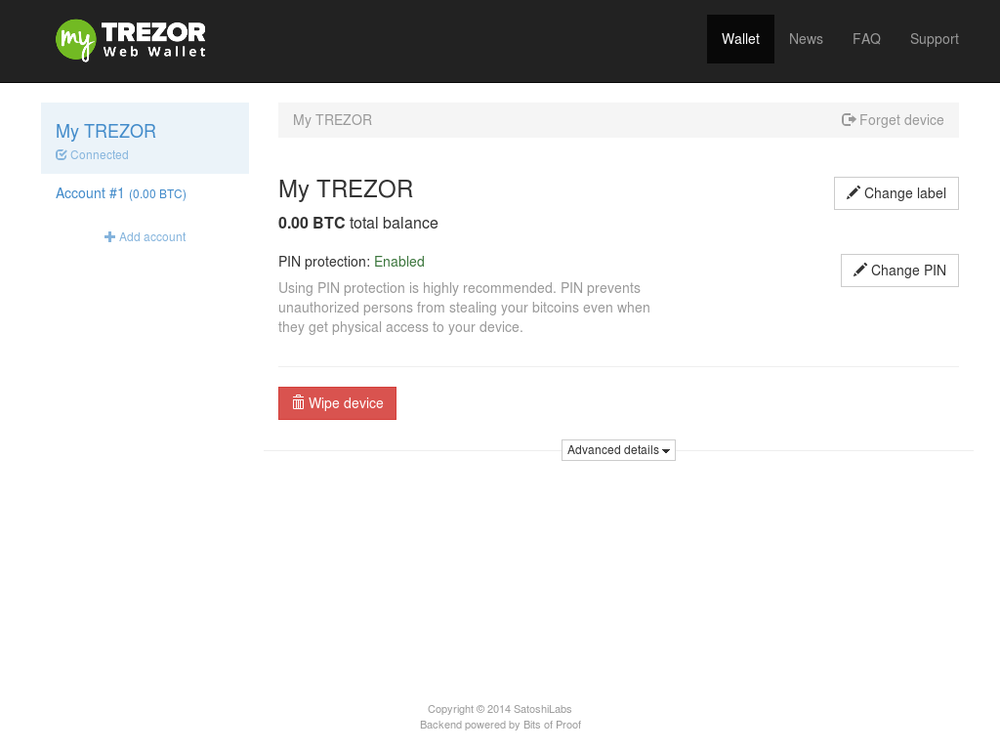
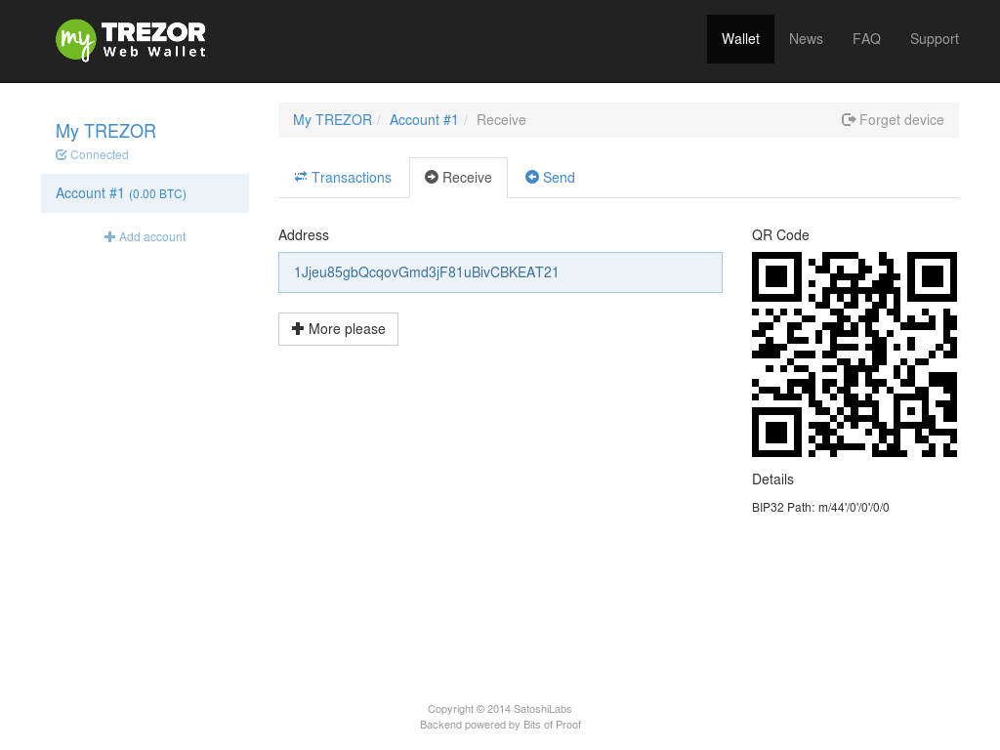
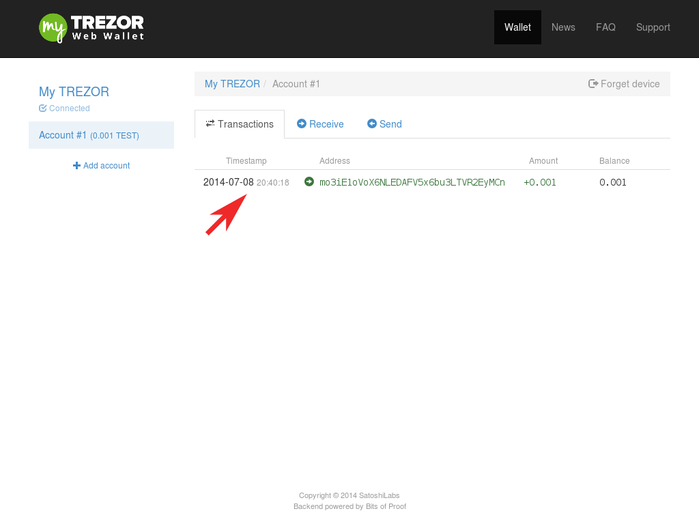

Receiving payments
==================

Once you've set up your TREZOR your myTREZOR wallet will now appear.

If you press on the Account #1 button you will see a list of addresses.  Big strings of numbers and letters.  You will also see a `QR code`_.

You don't have to keep these addresses secret.  Indeed, you should share them as widely as possible because it is with these numbers that people can send you money!

You'll also see a More please button.  Why would you want more addresses?  Say your first address is used by your employer to send you your salary.  You can tell when your employer has payed you because you receive bitcoins on that address.  Now, you want to sell your lawnmower to Bob.  How do you know when Bob has payed you and which payment came from Bob?  You can create a new bitcoin address specially for Bob.  When bitcoins come in to Bob's address you know that its Bob paying you and not your employer.

Confirming that a payment has been received
-------------------------------------------

When someone makes a payment to you, you will see a green(incoming) transaction appear in the transactions pane.

At first, the transaction will be marked as "unconfirmed".  Unconfirmed transactions have yet to be completed.  If a transaction is small and in person, it is safe to assume that the transaction will complete successfully.  However, if the transaction is large or coming from an untrusted party you should be more careful and wait for the transaction to complete.  Transactions can take up to 15 minutes to complete.  When they do so, you will see the "unconfirmed" text replaced by the date and time of the transaction's completion:

Once a transaction is complete, the bitcoins are yours.  There is no risk of reversal or charge back.

.. _`QR code`: http://www.whatisaqrcode.co.uk/

