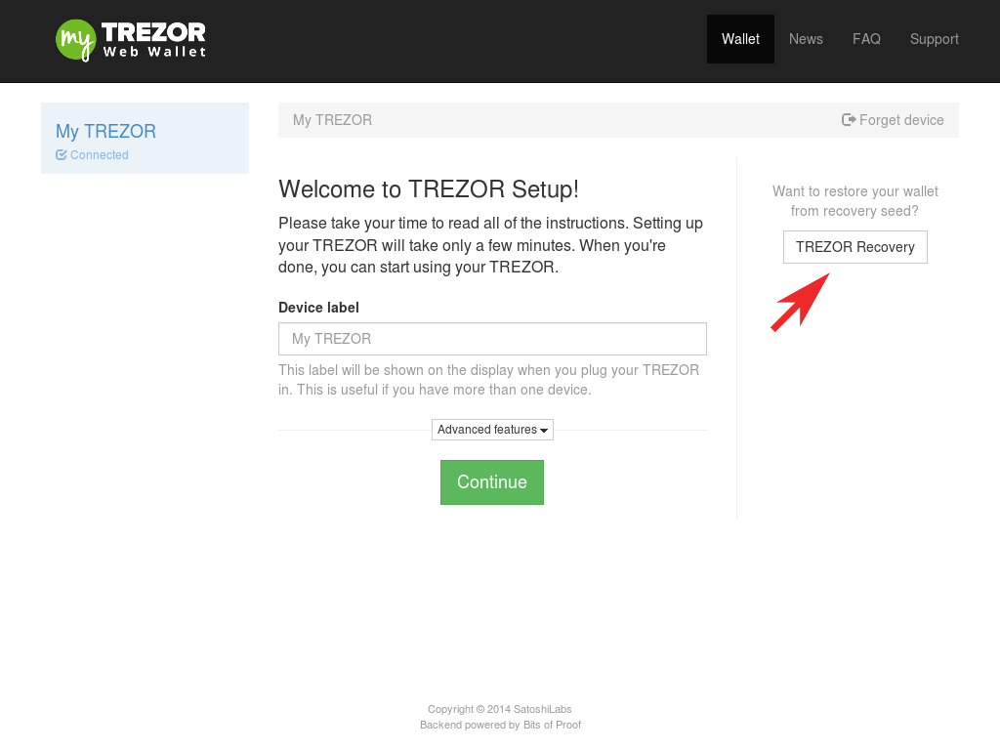
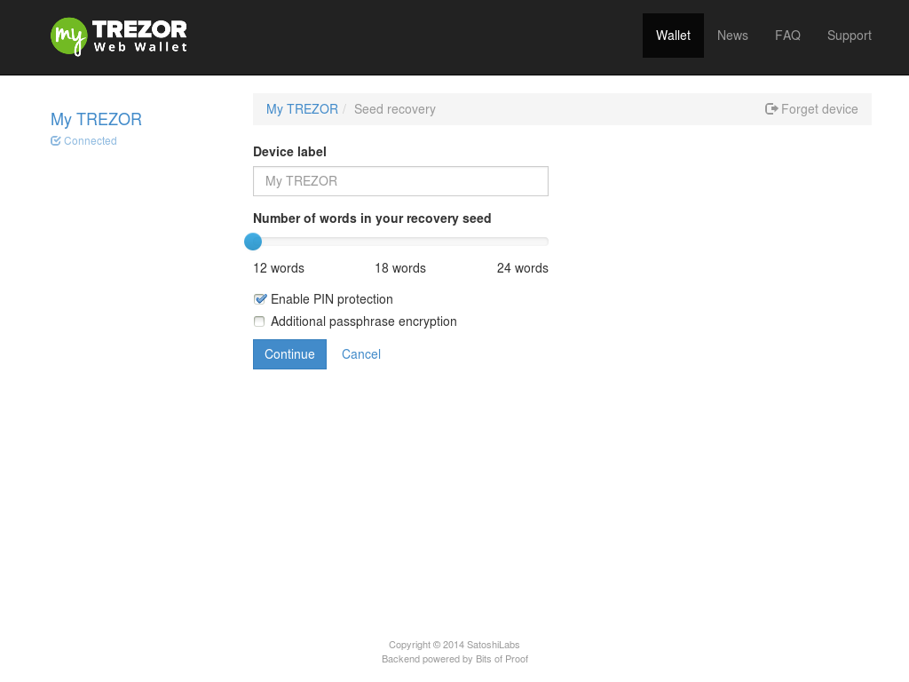
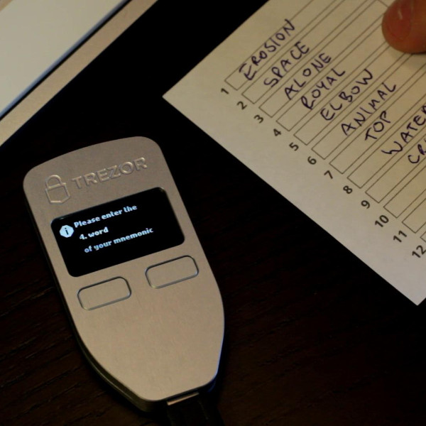
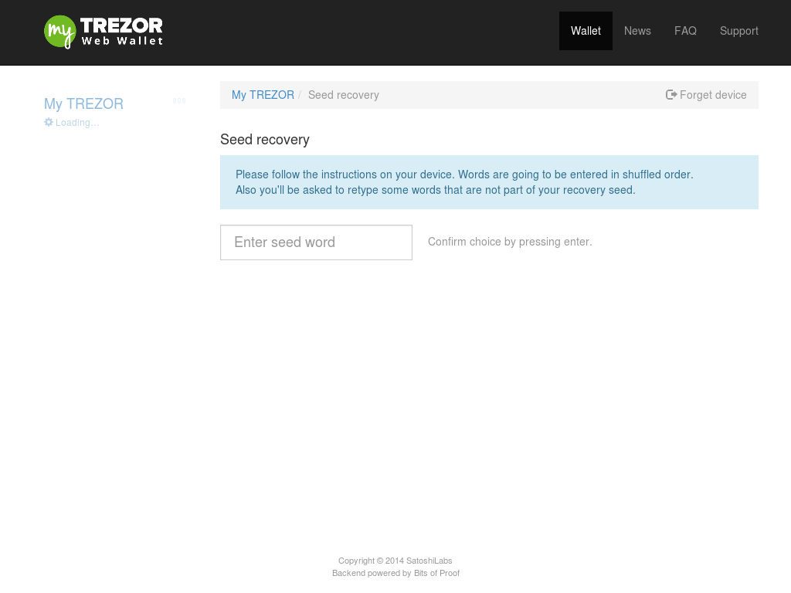

Recovery
========

Recovery process
----------------

If you lose your TREZOR or if your TREZOR somehow gets destroyed you may have to recover your accounts.  So long as your recovery card is intact your bitcoins are safe and sound.

What do you need to start your TREZOR recovery:

 - A new TREZOR
 - Your filled out TREZOR recovery card
 - A computer with the TREZOR bridge installed

To start your recovery plug your new TREZOR into your computer and go to |myTrezor|.  You should see a page like this with a TREZOR recovery button:

Press the TREZOR recovery button.

Enter the name of your TREZOR device.  If you setup your device without changing any advanced options you can simply press continue.  Otherwise configure the advanced options as they were before you lost your old TREZOR:  Look at your recovery card to see how many words your recovery seed has.  Check the "Additional passphrase encryption" box if your old TREZOR had a passphrase. And press continue.

You'll need to set up a new PIN for your new TREZOR device.  After that you can look down at your TREZOR and follow the instructions on the screen.

Then continue with entering the seed words from your recovery card.

After you have finished, you will be asked to enter your PIN again and then you should see all your accounts as they were before.  You can continue bitcoining away!

What happens if I forget my PIN?
--------------------------------

If you forget your PIN, you can reset it using the recovery process described above (you just don't need to get new device, you can use the original one).

.. |myTrezor| raw:: html

   <a href="http://mytrezor.com" target="_blank">myTREZOR.com</a>
