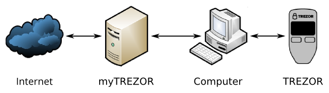

Security philosophy
===================

The zero trust principle
------------------------

TREZOR's security model is based on the principle of zero trust.  The zero trust principle says that any part of a secure system could at some point be compromised.

Your TREZOR device will continue to protect your bitcoins even in the case that the myTREZOR web wallet is hacked and your computer is infected by a virus.  This is important.  The whole point of TREZOR is being more secure than a traditional web wallet or desktop bitcoin application.

Why does the TREZOR have a screen and buttons?
----------------------------------------------

If you are using your TREZOR device with an untrusted computer and you want to make a payment, how do you know that the payment is going to the right person?  If the TREZOR did not have a screen it would be impossible to know that the payment was being made to the correct address.  After all, an infected computer could easily lie about where the money was going to go or how much was being sent.

By making the TREZOR with a screen and physical buttons, you know that no payments will ever be made without you being able to read their amount and being able to physically accept or cancel the payment.  This is the key distinction between TREZOR and a traditional smart card.

The need for a PIN
------------------

Zero trust doesn't end with not trusting the computer to which you have connected your TREZOR.  We also do not wish to trust the person who is currently holding the TREZOR in their hands.  What if your TREZOR was stolen?  In order to prevent trivial physical theft of the TREZOR device the TREZOR requires you to enter you PIN number each time it is plugged into a computer.  This ensures that not only is each transaction confirmed by a person who is physically present, but that the person confirming the transactions is you.

The PIN entry mechanism is specially designed so that the untrusted computer never learns your PIN.  It is also difficult to determine a person's PIN simply by looking over their shoulder.

A single purpose computer
-------------------------

The TREZOR is a single purpose computer.  TREZOR doesn't have a weather app.  There are no free downloads for TREZOR that could compromise the device.

Limiting the attack surface: no battery, WiFi, Bluetooth, fingerprint reader, NFC
---------------------------------------------------------------------------------

Any time a computer has to deal with untrusted information there is a risk that the computer will be infected with malware.  The TREZOR is no exception.  In order to limit the attack surface against the TREZOR, TREZOR communicates solely through a simple USB protocol.  There is no WiFi or Bluetooth, no camera for scanning QR-codes.  There's not even a fingerprint reader for identifying the user.  This is all because we want the TREZOR to be as secure as possible.  The fewer devices the TREZOR talks to, and the simpler its communication protocol is, the less likely it is to get infected.

The TREZOR also has no battery.  When its unplugged its off and your bitcoins are safe from cyber attack.
