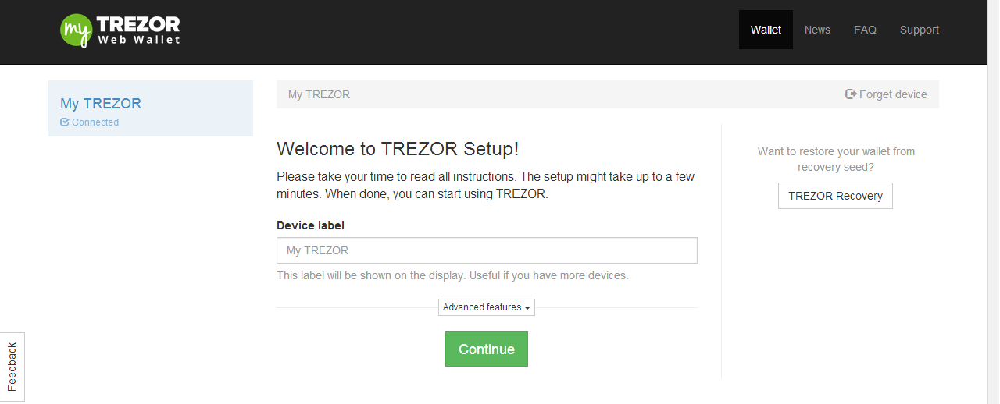

Setting up your TREZOR device
=============================

The TREZOR works with almost any computer that has a USB port and an internet connection.  To install the TREZOR drivers go to |myTrezor|.  You should see a page with a Download link.  Download the TREZOR software and follow the instructions on the screen.

Once you've got the TREZOR driver installed go to |myTrezor| again.  This time you should see a web page welcoming you and asking for a device label:

Enter a new name for your TREZOR device and press Continue.  You should see a matrix of question marks.  Now go on to :doc:`Entering your PIN <enteringyourpin>`.

.. note:: There are also several :doc:`advanced settings <advanced_settings>` that you can configure.

.. toctree::
   :maxdepth: 2

   enteringyourpin
   fillingoutyourrecoverycard

.. You don't need to use the |myTrezor| webservice if you want to use your TREZOR device.  You can use any bitcoin software that supports TEZOR including:

 - Electrum
 - Multibit

.. |myTrezor| raw:: html

   <a href="http://mytrezor.com" target="_blank">myTREZOR.com</a>
