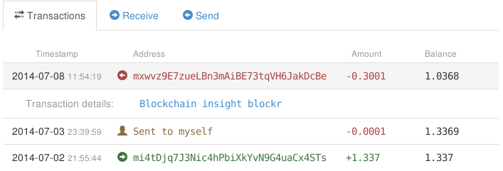

Understanding transaction details
---------------------------------

myTREZOR.com displays several transaction details that it is good to become familiar with.

**Timestamp**
    A timestamp is the time when a given transaction completed being processed.  When a transaction is first made, its timestamp will display as "unconfirmed".  Once the transaction has completed successfully it will display as a date and time.  **Note**:  For large transactions, you should always wait for them to be confirmed before considering them to be complete!

**Address**
    This column always displays the address to which the coins were sent.  If you want to know who is sending you bitcoins, you need to "bill" them with their own unique adress to send to.  You can do this, by going to the receive tab and pressing "More Please".

**Amount**
    This column displays the amount of bitcoins transfered.  It is negative in the case of outgoing transactions.

**Balance**
    This column shows the total number of bitcoins in your account after the transaction completed.

If you click on a transaction in the Transactions list you will see a list of links to third party services which can provide you with more information about the transaction.
