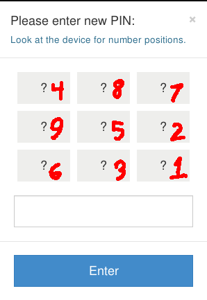

Entering your pin
========

You can use your TREZOR safely with any computer, even one you don't trust.  But you don't want to go entering your PIN into untrusted computers and ATMs.  We invented a new method of entering your PIN, one that is both convenient and highly secure:

.. image:: images/myTREZORnumberpad.png

Don't worry!  It is not as hard as it looks.  Each one of those question marks is a button, just like the number pad on an ATM.

Now look down at your TREZOR.

.. image:: images/Trezor-pin.jpg

If you hold your TREZOR up to your computer's screen, you can see that for every question mark, the TREZOR shows you a number.  The numbers on your TREZOR tell you what each of those buttons mean.  Taking the picture above as an example, the first question mark on the computer's screen is the '4' button.  The second question mark on the first row is the '8' button and so on.

So if you were to copy the numbers from your TREZOR's screen onto the question-mark pad in myTREZOR it would look like:

Now entering your pin should be easy!

When you are setting up your TREZOR for the first time, you'll have to enter your new PIN twice.  You'll then need to enter this same PIN each time you plug your TREZOR into a computer.

Now that you've entered your pin you can move on to :doc:`Filling out your recovery card <fillingoutyourrecoverycard>`.
