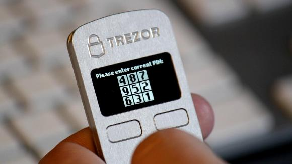

Entering your pin
========

You can use your TREZOR safely with any computer, even one you don't trust.  But you don't want to go entering your PIN into untrusted computers and ATMs.  The TREZOR doesn't make you enter your PIN directly into your computer and its therefore much more secure than the credit card you're used to.  But its also a little bit more complex.

.. image:: images/myTREZORnumberpad.png

Don't worry though, its not that hard and once you get the hang of it you'll be using truely military grade security.

If you look down at your TREZOR you'll see a grid filled with numbers not to different from the grid of buttons with questions marks on your screen.

If you hold your TREZOR up to your screen it is easy to imagine that the questionmarks would be filled in with the numbers on your TREZOR's screen.  The numbers on your TREZOR tell you what each of those buttons mean.  Try clicking on the buttons bellow to see what I mean.  See how they have the same numbers as on the TREZOR?

TODO-interactive-pin-widget

Now that you've entered your pin you can move on to :doc:`Filling out your recovery card <fillingoutyourrecoverycard>`.
