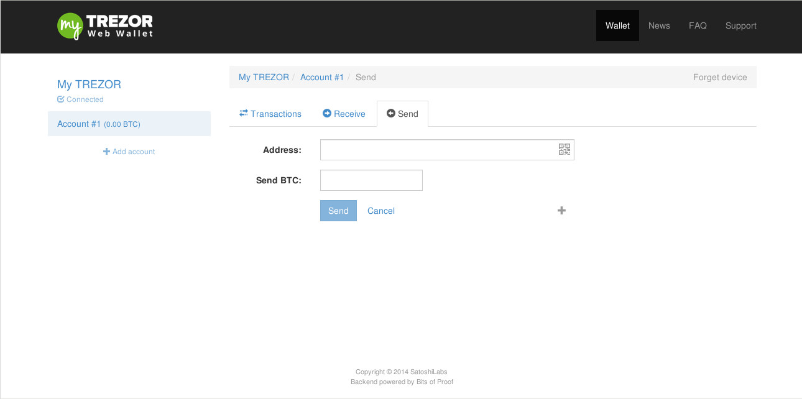

Making payments
========

In order to make payments, got the the account page in myTREZOR and press send.  You should see a payment page like this:

Here you can type in a destination address for your transaction and the number of bitcoins you want to send.

If the address you want to send to is on someone's cell phone, you might not want to type in the full address.   Chances are though, that they'll also be able to show you the QR code for their account.  You can scan a QR code with myTREZOR simply by pressing the scan QR code button in the address field and holding a picture of the QR code up to your computer's web cam.

.. image:: images/scanqrcode.jpg

.. note:: Each time you send bitcoins you have to pay a small transaction fee.  This fee will be automatically calculated for you by the myTREZOR wallet and charged against your account.