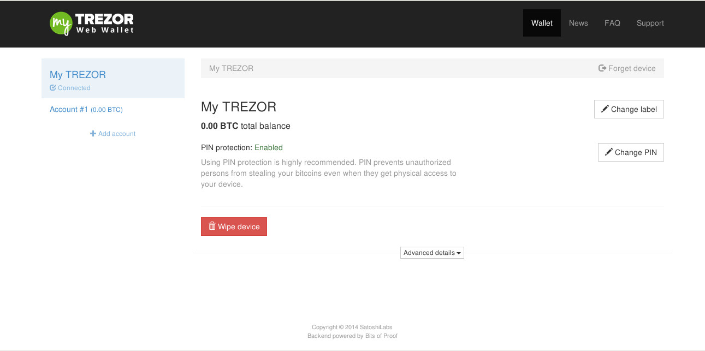

Receiving payments
========

Once you've set up your TREZOR your myTREZOR wallet will now appear.

If you press on the Account #1 button you will see a list of addresses.  Big strings of numbers and letters.  You will also see a `QR code`_.

.. image:: images/accountpage.jpg

You don't have to keep these addresses secret.  Indeed, you should share them as widely as possible because it is with these numbers that people can send you money!

You'll also see a More please button.  Why would you want more addresses?  Say your first address is used by your employer to send you your salary.  You can tell when your employer has payed you because you receive bitcoins on that address.  Now, you want to sell your lawnmower to Bob.  How do you know when Bob has payed you and which payment came from Bob?  You can create a new bitcoin address specially for Bob.  When bitcoins come in to Bob's address you know that its Bob paying you and not your employer.

.. _`QR code`: http://www.whatisaqrcode.co.uk/

