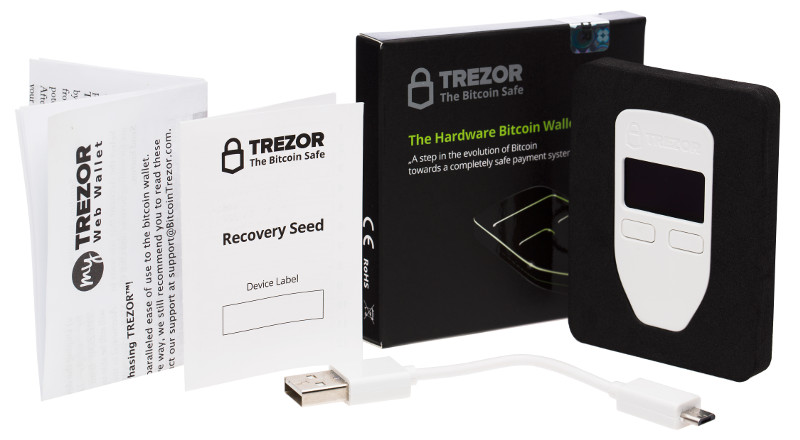

What's in the box?
==================

So today you got your TREZOR.  Congratulations!  In the small box with the shiny TREZOR seal on it you should find:

- Your new TREZOR
- USB cable for your TREZOR
- A little booklet where you'll write down your recovery seed
- Your TREZOR user guide

.. note:: Your TREZOR doesn't have any batteries in it.  So you won't see anything on the screen until you plug it in.

Check the security seal
-----------------------

Make sure that the silver security seal is unbroken to ensure you are working with an authentic TREZOR device.

  .. image:: images/box-with-seal.jpg

Go ahead and plug your TREZOR in now.  You should see the glowing TREZOR lock appear on the screen.  Now move on to :doc:`Setting up your TREZOR device <settingup>`.
